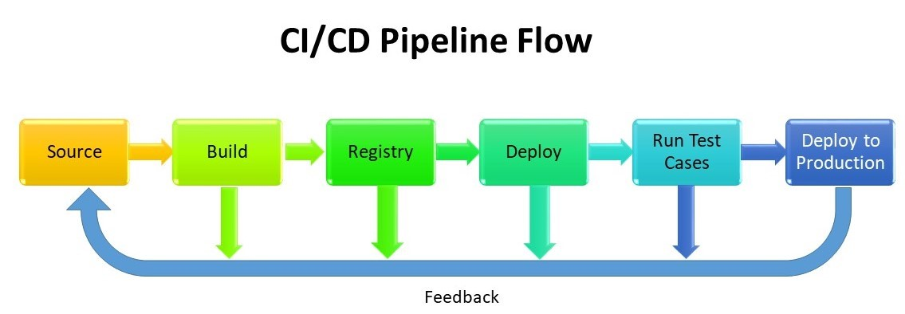
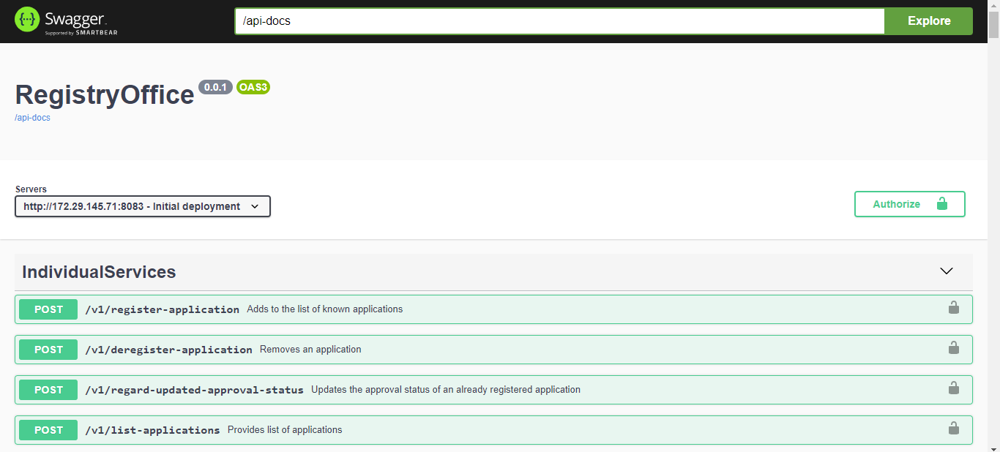
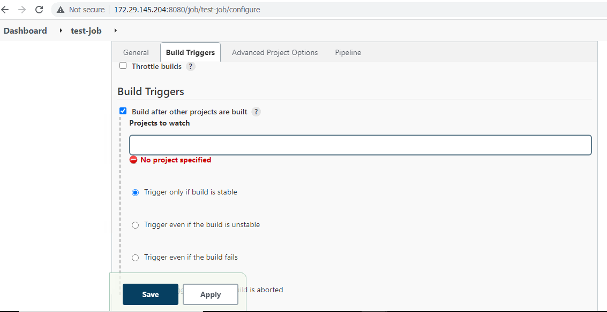

## 6.4. Create pipeline jobs with all necessary configurations 

Login into Jenkins under Dashboard left side click on New item==>Enter an item name (Jenkins job name)==>select pipeline job then click on ok. 

 

 

 

After creating the job, open job and Goto, the build trigger section==> click on Poll SCM and schedule the job timings as per our requirement. 

Poll SCM monitoring pipeline job and checks as per time interval if any update happens in Source code repos, then it Build the Jenkins job. 

 

 

After scheduling Poll SCM Goto, Pipeline section here we have two option pipeline script and Pipeline script from SCM. 

If we choose Pipeline script, we need to enter developed pipeline script directly in job itself. 

If we choose Pipeline script from SCM then first we create one file in GitHub repo like Jenkinsfile then add the pipeline script in this file. 

After creating Jenkins file Goto Jenkins pipeline job under pipeline section select Pipeline script from SCM and add Repository URL details with specific branch. 

Then click on apply and save to save configurations. 

 

 

## 6.5. Develop pipeline script for application deployment 

#### 6.5.1. Pipeline Stages 

Source stage 

Build stage 

Publish Docker image 

Deploy application as a container.(TestLab) 

Save docker image in local server. 

Test stage (Acceptance tests in TestLab and integration tests in Production) 

Deploy to production. 

#### 6.5.2. CI/CD Pipeline Flow 

 

 

#### 6.5.3. Declarative pipeline script 

pipeline {
    agent {
        label 'WebApp_1'
    }

    stages {
        stage ('source stage') {
            steps {
             
                git branch: 'develop', url: 'https://github.com/openBackhaul/RegistryOffice.git' //credentialsId: 'github-jenkins'
            }
        }
        stage ('Docker Build and Tag') {

            steps {

                dir ('server')
                    {
                    sh 'docker ps -a'
                    sh 'docker stop registry-office-v1'
                    sh 'docker rm registry-office-v1'
                    sh 'docker rmi cicd_user/registry-office-v1'
                    sh "sed -i 's/^RUN npm install/RUN  npm --proxy http:\\/\\/172.16.1.2:8080 --without-ssl --insecure -g install/' dockerfile"
                    sh 'docker build -t cicd_user/registry-office-v1 .'
                    //sh 'docker tag registry-office-v1 cicd_user/registry-office-v1:$BUILD_NUMBER'
                }
            } 
        }
        /*stage('Publish image to Docker Hub') {
          
            steps {

                withDockerRegistry([ credentialsId: "dockerHub", url: "" ]) {
                    sh  'docker push cicd_user/registry-office-v1'
                    //sh  'docker push cicd_user/registry-office-v1:$BUILD_NUMBER' 
                }       
            }
        }*/         
        stage('Run Docker container') {
             
            steps {

                sh 'docker run -d -p 8083:3000 --name registry-office-v1 -v TinyApplicationControllers:/home/openbackhaul/database/registryOffice cicd_user/registry-office-v1'
                echo '==========> List Images <=========='
                sh 'docker images'
                echo '=========> List Container <========='
                sh 'docker ps -a'
 
            }
        }
        /*stage('Run Docker container on remote hosts') {
             
            steps {

                sh 'docker -H ssh://jenkins@remote ip run -d -p 3000:3000 repo-name'
 
            }
        }*/
        stage('save Docker image'){

            steps{

                sh 'docker save -o /home/WebApp/gitlab_stage/docker-images-list/cicd_user-registry-office-v1-$(date +%Y-%m-%d-%H:%M:%S).tar cicd_user/registry-office-v1'

            }
        }
        /*stage(test){
              
            steps {
                echo 'Running Acceptence Test for app..'
                //sh  'docker -H ssh:cicduser@172.29.145.204:/home/cicduser/app/'
                dir('test-scripts'){
                    sh 'node RegistryOffice.js'
                }
            } 
        }*/
    }
    post {
        success {
            echo 'Deploy RegistryOffice Application completed in WebApp server..'
            //mail to: manoj.arra.external@telefonica.com, subject: ‘The Pipeline success :(‘
            
        }
    }
}

After deploying Application 

Go to the browser and check with the Ip address with port 8083 like
below:

[http://172.29.145.71:8083/docs/](http://172.29.145.71:8081/docs/)

 

## 7.  Configure Pipeline job for running Acceptance test cases 

 

First, we create one pipeline job with the above guidelines in Jenkins for running testcases. 

Then in Jenkins Dashboard click on created test cases job ==>left side menu we have configure option click on this ==> under build trigger section select build after other projects are built? Option and enter above configured application deployment pipeline job in projects to watch session and select Trigger only if build is stable. 

Then Goto the pipeline section and enter following code for running test cases and click on apply and save button for save job configurations. 

pipeline { 
    agent { 
        label 'jenkins-master' 
    } 
    stages { 

        stage ('source stage') { 

            steps { 

                git branch: 'develop', url: 'https://github.com/openBackhaul/RegistryOffice.git' //credentialsId: 'github-jenkins' 

            } 

        } 

        stage ('copy RO postman collection file') { 

            steps { 

                 dir ('/var/lib/jenkins/workspace/RO_testcases/test-suites') 

                    { 

                    sh 'cp RegistryOffice_0.0.1_tsi.date.time+testcases.1.postman_collection /var/lib/jenkins/workspace/RO_testcases' 

                } 

            } 

        }           

        stage ('run Acceptance test cases') { 

            steps { 

                 dir ('/var/lib/jenkins/workspace/RO_testcases/') 

                    { 

                    sh 'newman run RegistryOffice_0.0.1_tsi.220504.1008+testcases.1.postman_collection -d  RegistryOffice_0.0.1_tsi.date.time+data.no.json -r htmlextra,cli --reporter-htmlextra-logs' 

                } 

            } 

        }   

                stage ('Print test results in workspace dir.') { 

            steps { 

                 dir ('/var/lib/jenkins/workspace/RO_testcases/newman') 

                    { 

                    sh 'ls -lrt' 

                } 

            } 

        }   

    } 

    post { 

        success { 

            echo 'Acceptance test cases are successfully running on TAR Application..' 

            //mail to: manoj.arra@ojas-it.com, subject: ‘The Pipeline success :(‘ 

        } 

    } 

} 

Finally, we deployed NodeJS application in Docker as a container through Jenkins CICD pipelines in Testlab environment.

## 8.  Application deployment in production

Once Docker image deployed as a container in Testlab environment we save the docker image in Tar format in WebApp server. 

Here we copied the docker image tar file manually to the production servers.  

Once we copied the docker image tar file to production servers (appserver) then we ran the Jenkins pipeline job following way. 

Configure Jenkins Pipeline job in Production environment: 

Here the same how we configure Pipeline job in testbed environment the same way we have to configure and install all necessary things in Jenkins server (10.40.0.36) and appserver (10.20.64.40). 

### We have to configure: 

- First make sure SSH connection between two servers. 

- Install all packages as we install like in testbed. 

- Configure Jenkins job in Jenkins server (10.40.0.36). 

- Configure slave nodes (10.20.64.40) in Jenkins for deploying Application.  

- Create pipeline script for deploying Application. 

- Create pipeline script for running integration tests after deploying application as a container. 

# Create pipeline script for deploying Application. 

pipeline {
    
    agent {
        label 'Appserver_2'
    }

    stages {
        stage ('Docker image load stage') {
            steps {

                 dir ('/home/appserver/gitlab_prod/docker-images')
                    {
                    
                    sh 'docker images'
                    //sh 'docker ps -a'
                    //sh 'docker stop registry-office-v1'
                    //sh 'docker rm registry-office-v1'
                    //sh 'docker rmi cicd_user/registry-office-v1'
                    sh 'docker load -i cicd_user-registry-office-v1-2022-04-19-15:51:27.tar'
                    //sh 'docker tag aregistry-office-v1 cicd_user/registry-office-v1:$BUILD_NUMBER'

                }
            }
        }          
        /*stage('Publish image to Docker Hub') {
          
            steps {

                withDockerRegistry([ credentialsId: "dockerHub", url: "" ]) {
                    sh  'docker push cicd_user/registry-office-v1:latest'
                    //sh  'docker push cicd_user/registry-office-v1:$BUILD_NUMBER' 
                }       
            }
        }*/         
        stage('Run Docker container') {
             
            steps {

                sh 'docker run -d -p 8083:3000 --name registry-office-v1 -v TinyApplicationControllers:/home/openbackhaul/database/registryOffice cicd_user/registry-office-v1'
                echo '==========> List Images <=========='
                sh 'docker images'
                echo '=========> List Container <========='
                sh 'docker ps -a'
 
            }
        }
        /*stage('Run Docker container on remote hosts') {
             
            steps {

                sh 'docker -H ssh://jenkins@remote ip run -d -p 8083:3000 repo-name'
 
            }
        }*/
    }
    environment {
            EMAIL_TO = 'manoj.arra.external@telefonica.com'
        }
    post {
    	success {
                emailext body: 'Check console output at $BUILD_URL to view the results. \n\n ${CHANGES} \n\n -------------------------------------------------- \n${BUILD_LOG, maxLines=100, escapeHtml=false}', 
                        to: "${EMAIL_TO}", 
                        subject: 'Successfull Build in Jenkins: $PROJECT_NAME - #$BUILD_NUMBER'
        }
    	failure {
                emailext body: 'Check console output at $BUILD_URL to view the results. \n\n ${CHANGES} \n\n -------------------------------------------------- \n${BUILD_LOG, maxLines=100, escapeHtml=false}', 
                        to: "${EMAIL_TO}", 
                        subject: 'Build failed in Jenkins: $PROJECT_NAME - #$BUILD_NUMBER'
        }
        unstable {
                emailext body: 'Check console output at $BUILD_URL to view the results. \n\n ${CHANGES} \n\n -------------------------------------------------- \n${BUILD_LOG, maxLines=100, escapeHtml=false}', 
                        to: "${EMAIL_TO}", 
                        subject: 'Unstable build in Jenkins: $PROJECT_NAME - #$BUILD_NUMBER'
        }
        changed {
                emailext body: 'Check console output at $BUILD_URL to view the results.', 
                        to: "${EMAIL_TO}", 
                        subject: 'Jenkins build is back to normal: $PROJECT_NAME - #$BUILD_NUMBER'
        }
    }
}

Go to the browser and check with the Ip address with port 8083 like
below:

[http://10.20.64.41:8083/docs/](http://172.29.145.71:8081/docs/)

# Create pipeline script for Integration test cases running in production

pipeline {
agent {
label 'jenkins_master'
}

stages {
    stage ('source stage') {
        steps {
         
            git branch: 'develop', url: 'https://github.com/openBackhaul/RegistryOffice.git' //credentialsId: 'github-jenkins'
        }
    }
    stage ('copy RO postman collection file') {
        steps {

             dir ('/var/lib/jenkins/workspace/RO_Testcases/test-suites/')
                {
                
                sh 'cp RegistryOffice_0.0.1_tsi.date.time+testcases.1.postman_collection /var/lib/jenkins/workspace/RO_Testcases'
                
            }
        }
    }
    /*stage ('Replace  server details') {
        steps {

             dir ('/var/lib/jenkins/workspace/RO_Testcases')
                {
                
                sh "sed -i '' 's/https://125bf8ff-8193-4784-802a-b33bc1ec7879.mock.pstmn.io/http://10.20.64.41:8083//g' RegistryOffice_0.0.1_tsi.date.time+data.no.json"
                
            }
        }
    }*/
    stage ('run Integration test cases') {
        steps {

             dir ('/var/lib/jenkins/workspace/RO_Testcases/')
                {
                
                sh 'newman run RegistryOffice_0.0.1_tsi.date.time+testcases.1.postman_collection -d RegistryOffice_0.0.1_tsi.date.time+data.no.json -r htmlextra,cli --reporter-htmlextra-logs'

            }
        }
    }  
    stage ('Print test results in workspace dir.') {
        steps {

             dir ('/var/lib/jenkins/workspace/RO_Testcases/newman')
                {
                
                sh 'ls -lrt'

            }
        }
    }
}
environment {
        EMAIL_TO = 'manoj.arra.external@telefonica.com , rajitha.pitta.external@telefonica.com'
    }
post {
	success {
            emailext body: 'Check console output at $BUILD_URL to view the results. \n\n ${CHANGES} \n\n -------------------------------------------------- \n${BUILD_LOG, maxLines=100, escapeHtml=false}', 
                    to: "${EMAIL_TO}", 
                    subject: 'Successfull Build in Jenkins: $PROJECT_NAME - #$BUILD_NUMBER'
    }
	failure {
            emailext body: 'Check console output at $BUILD_URL to view the results. \n\n ${CHANGES} \n\n -------------------------------------------------- \n${BUILD_LOG, maxLines=100, escapeHtml=false}', 
                    to: "${EMAIL_TO}", 
                    subject: 'Build failed in Jenkins: $PROJECT_NAME - #$BUILD_NUMBER'
    }
    unstable {
            emailext body: 'Check console output at $BUILD_URL to view the results. \n\n ${CHANGES} \n\n -------------------------------------------------- \n${BUILD_LOG, maxLines=100, escapeHtml=false}', 
                    to: "${EMAIL_TO}", 
                    subject: 'Unstable build in Jenkins: $PROJECT_NAME - #$BUILD_NUMBER'
    }
    changed {
            emailext body: 'Check console output at $BUILD_URL to view the results.', 
                    to: "${EMAIL_TO}", 
                    subject: 'Jenkins build is back to normal: $PROJECT_NAME - #$BUILD_NUMBER'
    }
}

}

[<- Back to Jenkins Configurations](../Jenkins/Jenkins_Configuration.md) - - - [Back to Main](../main.md)
