# 1.3. GitLab versioning with VisualStudiocode

Repositories are created for every applications in GitLab. For more info
on the repositories, Pls visit

http://10.118.125.211/sdn

1.  Cloning Repository

**METHOD1:**

Open the terminal window within Visual Studio Code

Command: git clone repository URL

Description: Clones the repository from Remote server (Where GITLAB is
installed) to Local server (User PC)

Ex:

git clone <http://172.29.145.71/sdn/application/test-scripts.git> (For
Non TEF Laptop users)

git clone <http://10.118.125.211/sdn/application/test-scripts.git> (For
TEF Laptop users)

**METHOD 2:**

step 1: Click on Clone Git Repository

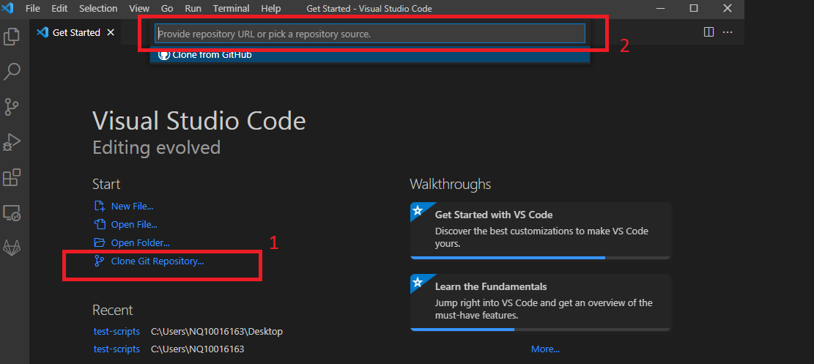

Step2: Enter the URL of the repository in the command palette.

2.  List all branch

**METHOD1:**

Command: git branch

Description: Lists all branches on the repository

Ex:

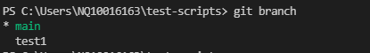

In the above example there are two branches on this repository. The user
is on the main branch.

**METHOD 2:**

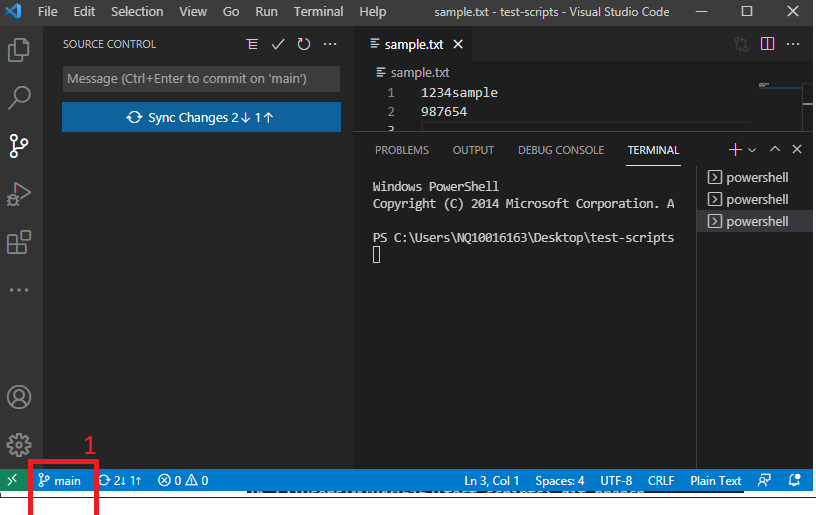

Click on the above menu, a command palette will appear which will list
all branches as shown in the below diagram.

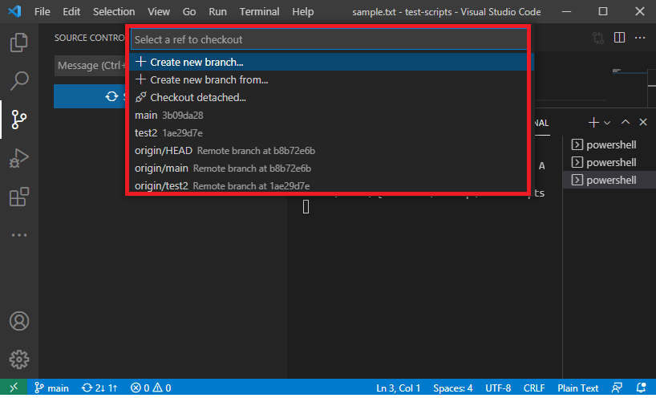

Note: In the above diagram, main and test2 are branches on your local
server (PC)

Origin/main and origin/test2 are branches on the remote server.

Always commit all changes on your local server branch and then push to
remote server.

3.  Checkout to a specific branch

**METHOD1:**

Command: git checkout ***branchname***

Description: Switches to the branch

Ex: git checkout test2

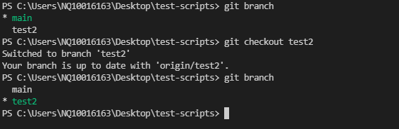

**METHOD2:**

Click on the menu as shown in the below diagram

Select the branch test2

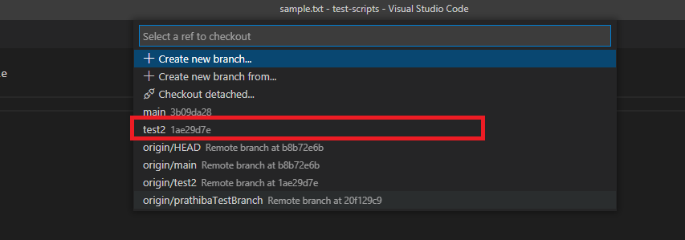

The selected branch is switched or checked out. It can be validated as
shown in the below snapshot.

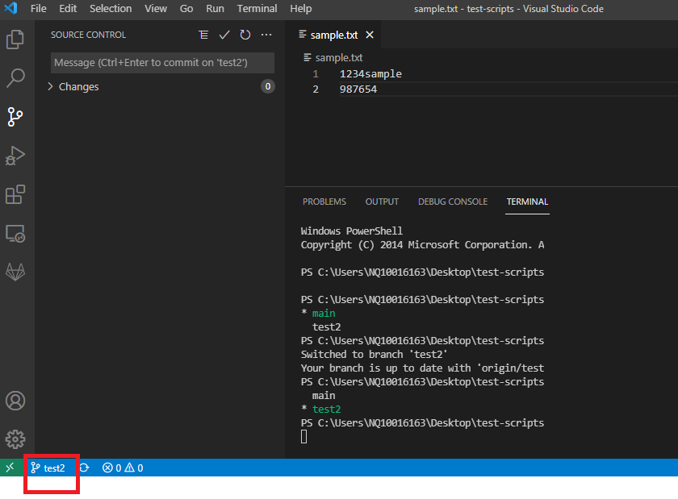

4.  Sync repository all branches from remote to Local

**METHOD1:**

Command1 : git checkout main

Description: Switches to the local main branch

Command2 : git pull origin

Description: Pulls changes in all branches from remote server to local
server.

**METHOD2:**

Switch to local main branch and follow the below steps.

Step1: Click on Source Control icon

Step 2: Click on Sync Changes

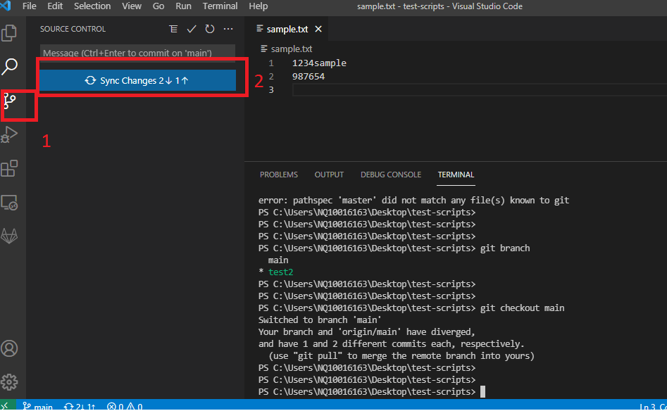

5.  Create new branch on local server and publish new branch to the
    remote server

If you are working on a feature, you first need to create your working
branch.

**METHOD1:**

Command1 : git branch ***branchname***

***Ex: git branch test3***

Description: Creates a new branch with name test2 from Main branch

Command2 : git branch

Description: List the branches created.

Command3: git checkout ***newbranchname***

Description: Checkout to the newly created branch on the local server.

Command4: git push --set-upstream origin ***newbranchname***

Description: Publish the locally created branch to the remote server.

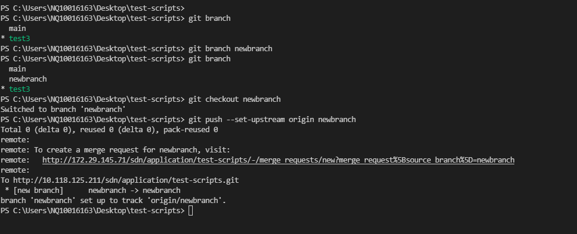

**METHOD2:**

Click on the branch menu and a command palette will appear. Then Choose
create new branch

Click on the above menu, a command palette will appear which will list
all branches as shown in the below diagram.

Click on Create new branch and provide a branch name.

Pls chose the branch name which explains the feature or individual
working on the branch.

Once entered, a new branch is created. Remember the newly created branch
is more local to you. In order to Publish the branch , Pls click on
Pusblish branch as shown in below diagram. This will publish the branch
to the remote server.

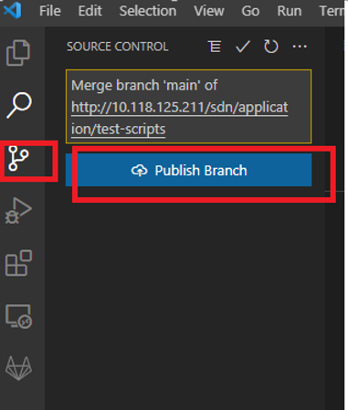

Once Published the remote branch shall appear in the command palette as
shown in below diagram.

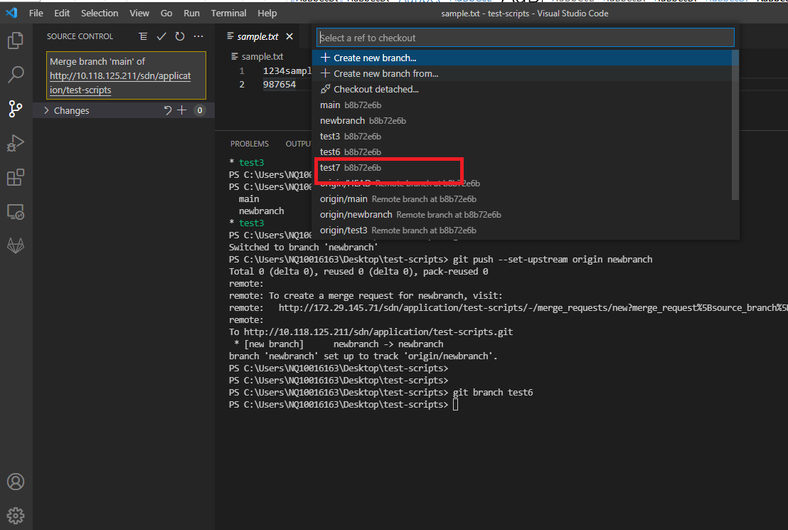

Creating a new file and adding the new Lines of codes.

Navigate to the explorer and Click icon to create a new file. Enter the
new file name. The file editor will be opened on the right.

Add all the content to the the file.

The circle indicates that files is not saved yet.

Ctl+s to save the file.

Note: The file is created on test7 branch on your local server. The file
is not yet pushed to the remote server. If you open GIT LAB URL and
navigate to test7 branch you cannot find the test7 file.

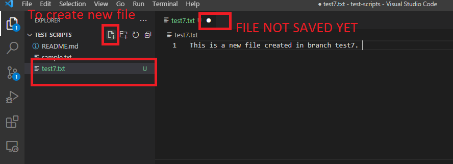

**Compare the changes:**

To compare the changes, click on changes and the file. In the below
diagram you can compare the difference between the remote server and
local server. In the below example the remote branch doesn’t have this
file. So the file is untracked. The area 1 is the content from remote
server. The are 2 is the file in the local server.

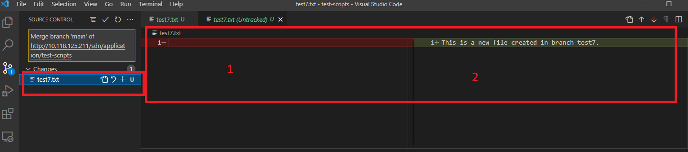

**Commit the Changes:**

**METHOD1:**

Click on the tick mark which will commit all changes.

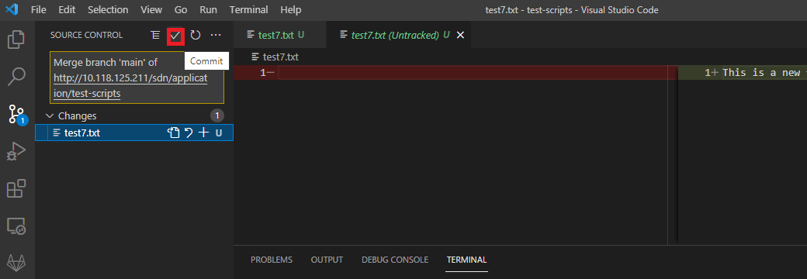

A dialog box appears and click on YES.

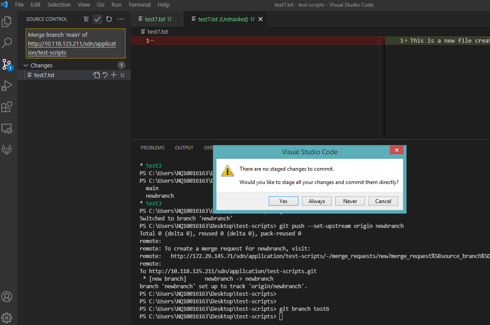

**METHOD2:**

Command1: git status -s

Description: Lists all the changes between the remote and local branch

Command2: git add -A

Description: Adds all the changes

Command3: git commit –m **commitmessage (Always provide some info in
commit)**

Description: Commits to the remote branch with a commit ID. A commit is
auto generated by the system. A reference point in the version.

Command4: git push origin

Description: Push all changes to the remote server.

In the below diagram.

Step 1: Added new words in the text file.

Step2:

Git status command is issued in the terminal and the File test7.txt
found in modified state (Red). Once added with git add –A, retrieve the
git status and file is in modified state (Green).

**States:**

M – Modified (Red)

U – Untracked

A – Added

D- Deleted

M – Modified and added (Green)

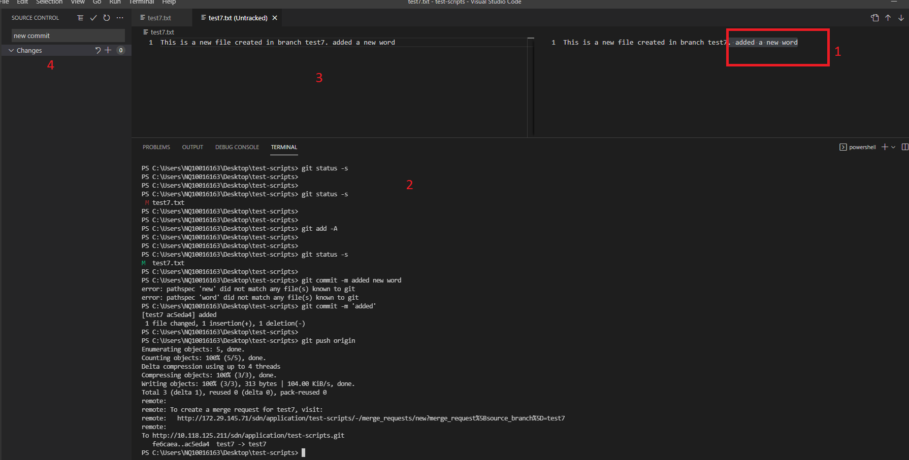

**Creating Pull Request:**

Once the development activity is completed within the local branch, they
need to pushed to the remote branch. Then a Pull request need to be
raised.

To create a merge request, login into the GIT LAB and click on Merge
request as shown in below diagram.

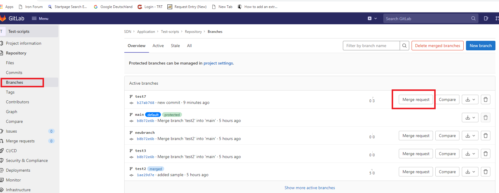

In the next page, Pls ensure the merge request is towards the main
branch from your working branch. Provide a relevant title and detailed
description for the reviewer.

Add the reviewer (Mandatory) and Click on Create Merge request.

A new merge request is created.

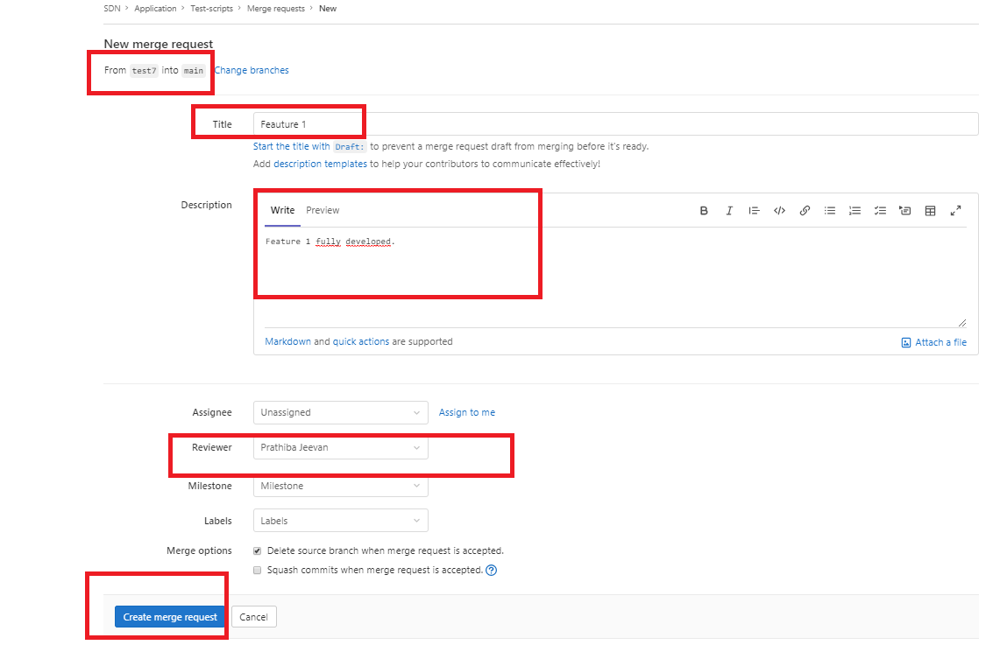

Reviewing Pull request

To list the merge requests, click on the Merge requests in GITLAB. The
merge requests will appear to the reviewer.

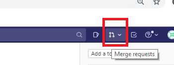

To perform the code review click on Changes in the Merge request form.

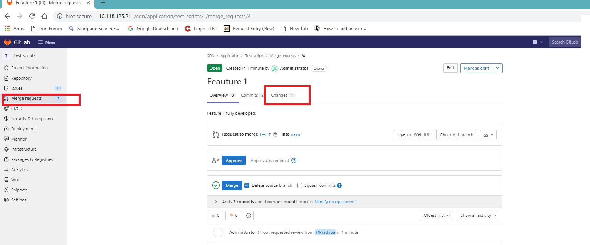

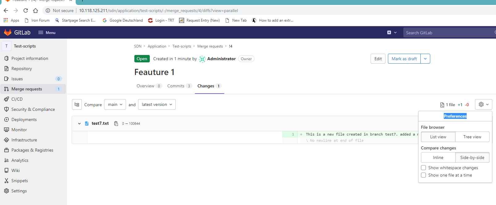

Click on the Preferences and choose Side – by Side to compare the
changes between the remote branch and the remote main.

In the below example, main branch doesnot contain the file and the
remote branch has a new file.

So review comments are updated in the below text.

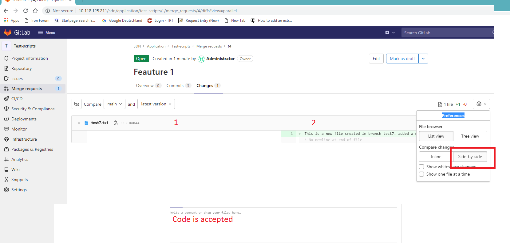

The reviewer can add comment to every Line of the code.

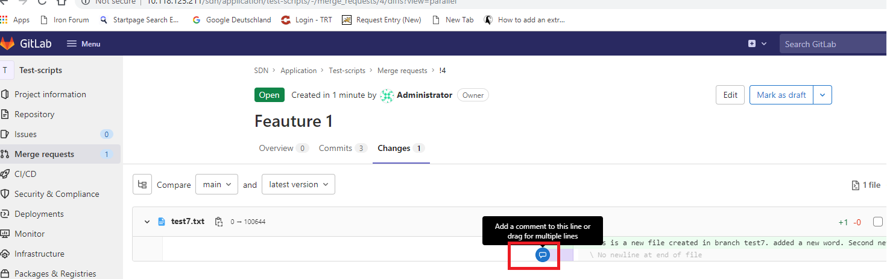

Once all review comments are incorporated, approver can Merge with the
option in the overview section of the Merge request.

**Handling Merge Conflicts:**

Lets say there is a test.txt file in the main branch. Two users created
new branch from main branch. Lets say both modified the test.txt file.
Lets say user 1 created the merge request and approver approved the
merge request. So user 1 changes already went into the Main branch.

When user 2 raises a merge request in GITLAB, he will see a merge
conflict. User 2 need to compare the changes between the remote main
branch and his local branch. Need to accept which version to be
accepted. Create a new commit with all accepted changes. Merge request
is reviewed and accepted. Once merged, user 2 will pull all changes from
remote main branch to local main branch.

**Tag:**

Once the main branch is fulfilled with all features planned. Then tag
can be created. The tag name usually a point where the version of
feature 1 is freezed. Then a new branch is created ‘Release branch’. No
further feature development is done on the release branch. This branch
is released for CI/CD deployment. If there are bugs, a new bug fix
branch is sourced from the release branch. All bug fixes are committed
to release branch.

**Fork:**

A fork branch is a duplicate branch to the working branch. It is used to
validate interim ideas without hampering the working branch.

[<- Back to GitLab Advantages_and_Disadvantages](../GitLab_Overview/Advantages_and_Disadvantages.md) - - - [Up to Main](../main.md) - - - [Ahead to GitLab Installation ->](../Installation/GitLab_Installation.md)
