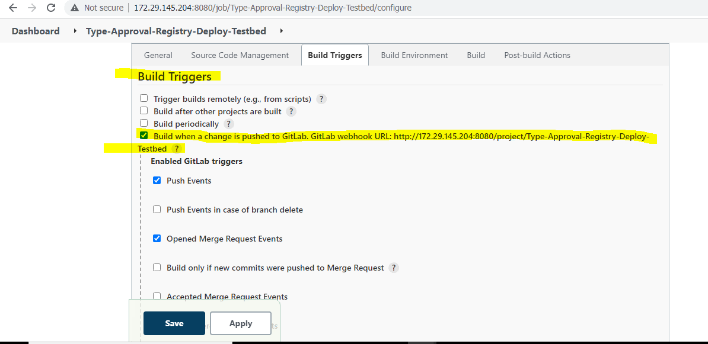
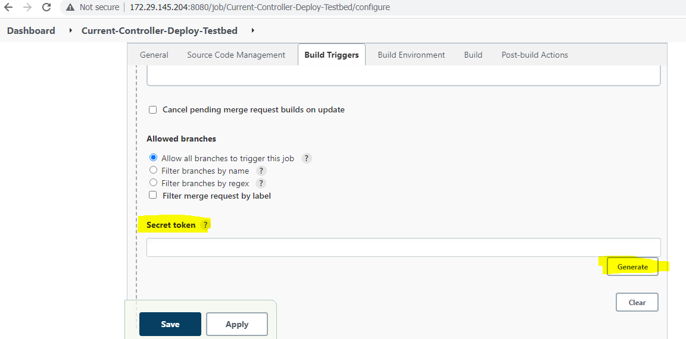
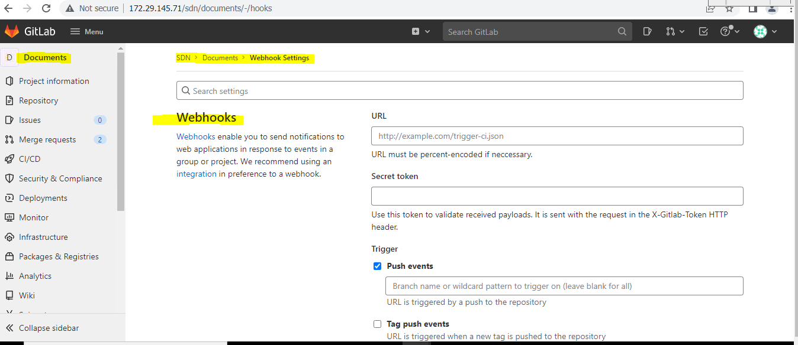
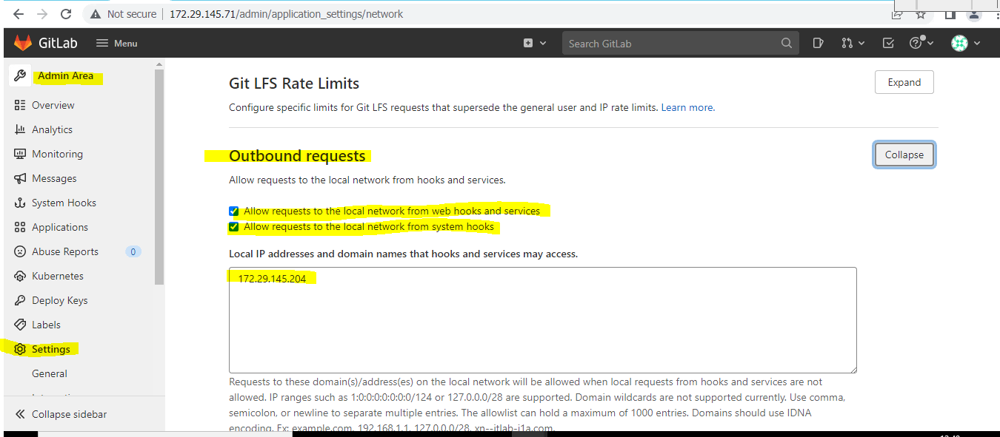
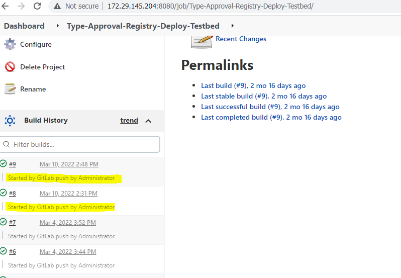

# **6. Configure GitLab Webhook in Jenkins**

**What is a webhook?**

A Webhook is a mechanism to automatically trigger the build of a Jenkins
Project upon a commit pushed in a Git repository or any other event you
choose.

In order for builds to be triggered automatically by PUSH and PULL
REQUEST events, a Jenkins Web Hook needs to be added to each Git
repository. You need admin permissions on that repository.

First you need to create a new GitLab project or choose an existing one.
Then, go to Project-\> Settings-\> Webhooks

Then there's configurations from Jenkins side and from GitLab side.

## \# **Jenkins side configurations:**

-   Install GitLab Webhook plugin in Jenkins

-   In Jenkins job \> build trigger: Check the GitLab Webhook

-   Click on advanced and generate token code

Copy the secret token and paste it in some safe place for further use.
This key is not available again. If you lose the key again, we need to
generate the key and configure it in GitLab.

Then click on the apply and save button to save configuration.

## \# **GitLab side configurations:**

-   Go to repository settings \> Webhooks

-   Add a New Webhook

-   Add URL of the Jenkins project like this
    [http://172.29.145.204:8080/project/my_Project/](http://192.168.179.135:8080/project/my_maven_Project/)

-   Add the generated token code from Jenkins build trigger section

-   Save and test

**There's a trick that must to be done to be created successfully**

-   Go to GitLab Admin Area \> Settings \> Network \> Outbound requests
    \> check on Allow requests to the local network from web hooks and
    services && Allow requests to the local network from system hooks \>
    Save Changes

Finally, you can enter the Jenkins IP Address manually in (Local IP
addresses and domain names that hooks and services may access).

We are all done to integrate Jenkins and GitLab. Now every time a
developer commits a code to GitLab, our build will be triggered.

This is how it will be looks like, you will notice (Started by GitLab
Push by Administrator)

So, When I pushed new updates to my project on GitLab, the Webhook that
i configured has been triggered the Jenkins job/project automatically.

**Referral links:**

<https://www.linkedin.com/pulse/how-configure-gitlab-webhook-jenkins-mohamed-elemam?trk=read_related_article-card_title>

<https://docs.gitlab.com/ee/integration/jenkins.html>

[<- Back to Manage GitLab Groups and Projects](../Manage_GitLab_Groups_And_Projects/Groups_And_Projects.md) - - - [Up to Main](../main.md) - - - [Ahead to SSH-Keys in GitLab ->](../Other_Configuration_In_GitLab/Configure_SSH_Keys_In_GitLab.md)

