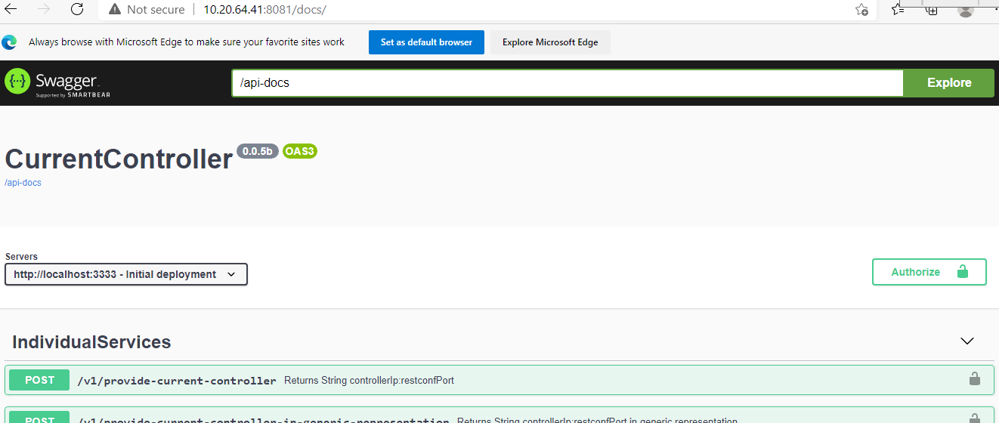

**<u>Implemented steps for CI-CD Pipeline:</u>**

1.  Installed Jenkins and configured it.

2.  As per requirement Installed Jenkins plugins Manually.

3.  Configured SSH for Password-less authentication to Remote servers in
    Jenkins.

4.  Installed GitLab and configured it.

5.  In GitLab add SSH keys and Generate tokens for communication with
    Jenkins's server.

6.  Added triggers to build job with another Job.

**<u>Current-Controller Application Deployment</u>**

**<u>In Testbed</u>**

**<u>Steps:</u>**

Create a Jenkins job for:

1.  Clone code from GitLab server.

2.  Once code has cloned go to server folder where Docker file exist.

3.  Check the docker images and containers if anything exists previously
    with same image and remove them.

4.  Build the Docker image from updated **Dockerfile**.

5.  Verify the list of Docker images.

6.  Deploy the container into WebApp server from New Docker image.

7.  Verify the running containers in WebApp server.

8.  Once container has deployed run the Test-cases through **Newman** in
    CI/CD server.

Go to the browser and check with the Ip address with port 8081 like
below:

[http://171.29.145.71:8081/docs/](http://172.29.145.71:8081/docs/)

**<u>Registry-Office Application Deployment</u>**

**<u>In Testbed</u>**

**<u>Steps:</u>**

Create a Jenkins job for:

1.  Clone code from GitLab server.

2.  Once code has cloned go to server folder where Docker file exist.

3.  Check the docker images and containers if anything exists previously
    with same image and remove them.

4.  Build the Docker image from updated **Dockerfile**.

5.  Verify the list of Docker images.

6.  Deploy the container into WebApp server from New Docker image.

7.  Verify the running containers in WebApp server.

8.  Once container has deployed run the Test-cases through **Newman** in
    CI/CD server.

Go to the browser and check with the Ip address with port 8083 like
below:

[http://172.29.145.71:8083/docs/](http://172.29.145.71:8081/docs/)

**<u>Current-Controller Application Deployment</u>**

**<u>In GCP</u>**

**<u>Steps:</u>**

Create a Jenkins job for:

1.  Upload Docker image tar file to App server

2.  Load the Docker image in App server.

3.  Check the docker containers if anything is running previously with
    same container port then stop the container and remove it.

4.  Deploy the container into App server from New Docker image.

5.  Verify the Docker images and running containers in App server.

6.  Once container has deployed run the Test-cases through **Newman** in
    CI/CD server.

Go to the browser and check with the Ip address with port 8081 like
below:

[http://10.20.64.41:8081/docs/](http://172.29.145.71:8081/docs/)

**<u>Registry-Office Application Deployment</u>**

**<u>In GCP</u>**

**<u>Steps:</u>**

Create a Jenkins job for:

1.  Upload Docker image tar file to App server

2.  Load the Docker image in App server.

3.  Check the docker containers if anything is running previously with
    same container port then stop the container and remove it.

4.  Deploy the container into App server from New Docker image.

5.  Verify the Docker images and running containers in App server.

6.  Once container has deployed run the Test-cases through **Newman** in
    CI/CD server.

Go to the browser and check with the Ip address with port 8083 like
below:

[http://10.20.64.41:8083/docs/](http://172.29.145.71:8081/docs/)

**<u>Future implement steps for CI-CD Pipeline:</u>**

1.  Configure Nodes in Jenkins.

2.  Run Jenkins Job with pipeline scripts.

3.  Trigger Jenkins jobs with Webhooks from GitLab to configure
    automatic builds.

4.  Add Email notification after build.

Optional:

5.  Docker with docker-compose.

cd /home/WebApp/gitlab_stage

git clone "git@172.29.145.71:sdn/application/currentcontroller.git"

cd /home/WebApp/gitlab_stage/currentcontroller/server

docker ps -a

docker stop current-controllerv1

docker rm current-controllerv1

docker rmi intval/current-controller

docker build -t intval/current-controller .

docker images

echo "=========\> List Containers \<========="

docker run -d -p 8081:3333 -v
\~/CurrentController/dataStore:/home/intval/CurrentController/dataStore
--name current-controllerv1 intval/current-controller

echo "==========\> List Images \<=========="

docker ps

**<u>Docker file for current-controller:</u>**

FROM node:14

\# Create app directory

WORKDIR /home/intval/util/V2

\# Install app dependencies

\# A wildcard is used to ensure both package.json AND package-lock.json
are copied

\# where available (npm@5+)

COPY package\*.json ./

RUN npm --proxy http://172.16.1.2:8080 \\

\> --without-ssl --insecure -g install

\#RUN npm install

\# If you are building your code for production

\#RUN npm install

\# Bundle app source

COPY . .

EXPOSE 8081

CMD \[ "node", "index.js" \]

Cicd server:

In Testbed: 172.29.145.204

In GCP: 10.40.0.36

GitLab server:

In Testbed: 172. 29.145.71

In GCP: 10.40.0.35

Application Deployed servers:

In Testbed: 172.29.145.71

In GCP: 10.20.64.41

Testcases running server:

In Testbed: 172.29.145.204

In GCP: 10.40.0.36

[<- Back to list of jenkins jobs](../Jenkins_Jobs/List_Of_Jobs.md) - - - [Up to Main](../main.md) - - - [Ahead to Pipeline Job For Application Deployment ->](../Jenkins_Jobs/SDN_Application_Deployment_Through_CI-CD.md)
