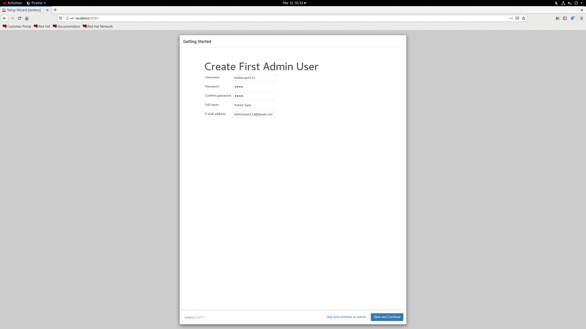
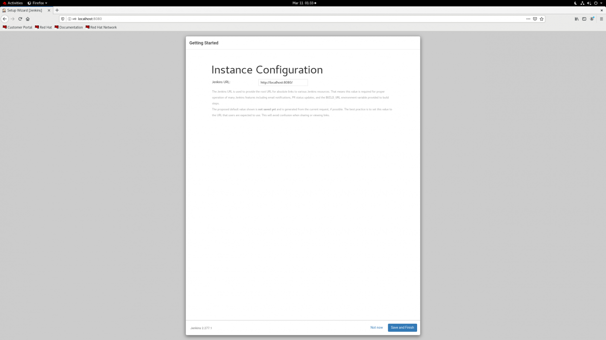
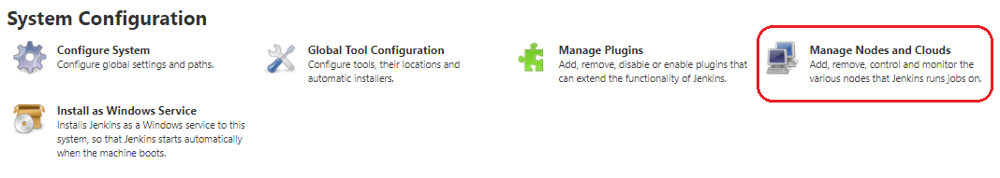
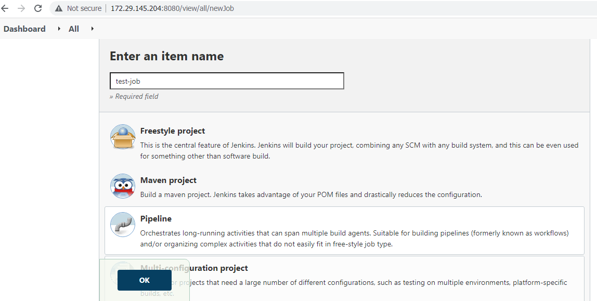
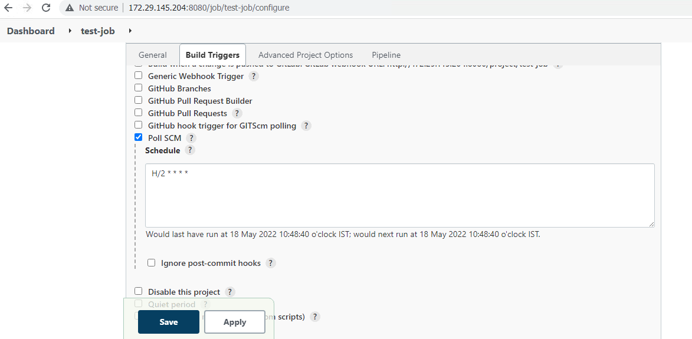
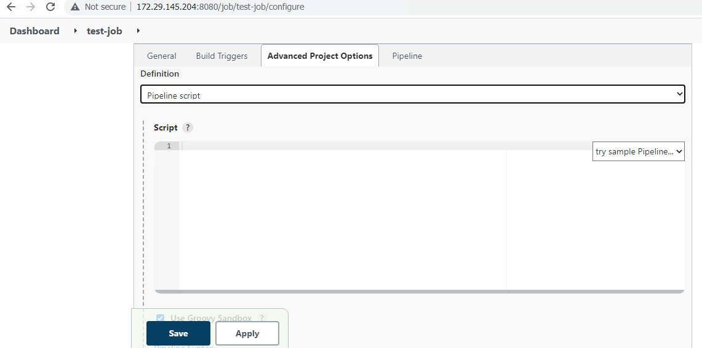
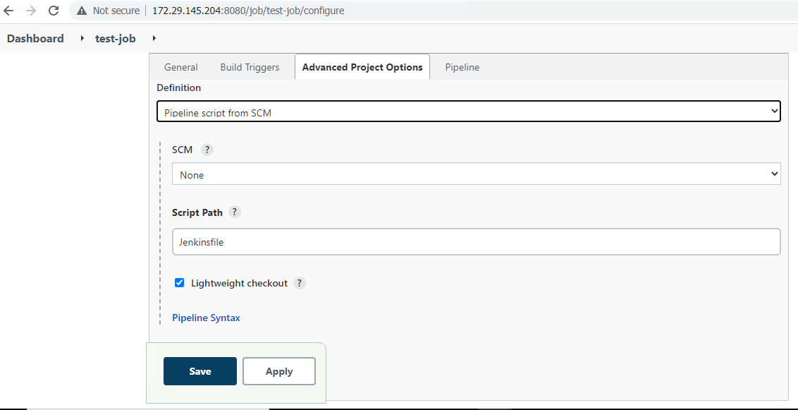

# SDN_Application_Deployment_Through_CI/CD 

**Table of Content** 

[1. Overview about Application deployment](./Overview/Overview.md) 

[2. Application Process flow diagram](./Overview/App_flow.md) 

[3. Prerequisites](./Overview/Prerequisites.md) 

  [3.1. Configure SSH connection between two servers (Jenkins and WebApp servers)](./Overview/SSH_configuration.md) 

[4. Challenges](./Overview/Challenges.md) 

[5. Required tools to install](./Installation/tools_list.md) 

 [5.1. Install Git](./Installation/tools_Install.md) 

 [5.2. Install Java](./Installation/tools_Install.md) 

 [5.3. Install Docker](./Installation/tools_Install.md) 

  [5.3.1. To start docker service](./Installation/tools_Install.md) 

  [5.3.2. Run docker commands without sudo](./Installation/tools_Install.md) 

 [5.4. Install NodeJS and NPM packages](./Installation/tools_Install.md) 

 [5.5. Install Newman packages and Newman reporter htmlextra package](./Installation/tools_Install.md) 

 [5.6. Install Jenkins](./Installation/tools_Install.md) 

[6. In Jenkins server](./Jenkins/Jenkins_Configuration.md) 

 [6.1. Jenkins overview](./Jenkins/Jenkins_Configuration.md) 

  [6.1.1. What is Jenkins and why do we use it?](./Jenkins/Jenkins_Configuration.md) 

  [6.1.2. Advantages of Jenkins](./Jenkins/Jenkins_Configuration.md) 

 [6.2. Install all required plugins](./Jenkins/Jenkins_Configuration.md) 

 [6.3. Configure master-slave configuration for deploying application](./Jenkins/Jenkins_Configuration.md) 

 [6.4. Create pipeline jobs with all necessary configurations](./Jenkins/Jenkins_Job_Configuration.md) 

 [6.5. Develop pipeline script for application deployment](./Jenkins/Jenkins_Job_Configuration.md) 

  [6.5.1. Pipeline Stages](./Jenkins/Jenkins_Job_Configuration.md) 

  [6.5.2. CI/CD Pipeline Flow](./Jenkins/Jenkins_Job_Configuration.md) 

  [6.5.3. Declarative pipeline script](./Jenkins/Jenkins_Job_Configuration.md) 

[7. Configure Pipeline job for running Acceptance test cases](./Jenkins/Jenkins_Job_Configuration.md) 

[8.  Application deployment in production](./Jenkins/Jenkins_Job_Configuration.md) 
 

## 1. Overview about Application deployment 

Here in this document, we explained how we dockerized NodeJS application and how we deploy application as a container through Jenkins. 

We are using GitHub for Source code management, Jenkins for CI/CD process and docker for deploying application as a container.  

 

## 2. Application Process flow Diagram 

 

## 3. Prerequisites 

Required Two servers one is for Jenkins (CI/CD server) and another one for Application deployment (WebApp server). 

Configure SSH connection between two servers. 

## 3.1. Configure SSH connection between two servers (Jenkins and WebApp servers) 

ssh-keygen –t rsa 

Now share this Key with Slave Machine 

Now use 

ssh-copy-id -i ~/.ssh/id_rsa.pub slave’s ipaddress 

It will ask for root password of slave 

Do the Same steps in Jenkins master and Jenkins slave machines Like:  

ssh-copy-id -i ~/.ssh/id_rsa.pub 172.29.xxx.xxx 

ssh-copy-id -i ~/.ssh/id_rsa.pub 172.29.xxx.xxx 

 

## 4. Challenges 

This challenge is composed of 4 parts: GitHub Repos, build docker image, container creation and run test cases through CI/CD. 

First, we collect server application source code information and get the Source code Repositories (GitHub). 

As a second step, install and configure Jenkins. 

Make sure SSH connection between CI-CD and WebApp server. 

Third, create a CI/CD pipeline with Jenkins to build and run Acceptance test cases. 

Lastly, to complete deployment, Deploy application as a container. 

 

## 5. Required tools to install 

Here we Install following tools in both servers (Jenkins and WebApp) 

## List of tools to be Install 
- Git
- Java
- Docker
- Jenkins
- NPM packages and NodeJS
- Newman packages and Newman reporter htmlextra package 

## 5.1. Install Git 

$ sudo apt update 

$ sudo apt install git 

$ git - -version 

 Output: 

git version 2.25.1 

## 5.2. Install Java 

$ sudo apt install default-jre 

$ java –version 

 Output: 

openjdk version "11.0.11" 2021-04-20 
OpenJDK Runtime Environment (build 11.0.11+9-Ubuntu-0ubuntu2.18.04) 
OpenJDK 64-Bit Server VM (build 11.0.11+9-Ubuntu-0ubuntu2.18.04, mixed mode, sharing)) 

$ sudo apt install default-jdk 

$ javac –version 

Output: 

javac 11.0.11 

Referral links: 

https://www.digitalocean.com/community/tutorials/how-to-install-java-with-apt-on-ubuntu-18-04 

 

## 5.3. Install Docker 

Here we install docker from Default Repositories: 

$ sudo apt update 

$ sudo apt-get remove docker docker-engine docker.io 

$ sudo apt install docker.io 

$ Docker - -version 

### 5.3.1. To start docker service 

$ sudo systemctl start docker 

$ sudo systemctl enable docker 

$ sudo systemctl status docker 

### 5.3.2. Run docker commands without sudo 

$ sudo groupadd docker 

$ sudo usermod -aG docker [user] 

$ su - [user] // Enable the new settings 

$ id -nG // check to confirm the user is now a part of the docker group 

Referral links: 

https://phoenixnap.com/kb/install-docker-on-ubuntu-20-04 

## 5.4. Install NodeJS and NPM packages 

$ sudo apt get update 

$ sudo apt install nodejs 

$ node –v 

$ sudo apt install npm 

Referral links: 

https://linuxize.com/post/how-to-install-node-js-on-ubuntu-20-04/ 

## 5.5. Install Newman packages and Newman reporter htmlextra package 

$ npm install -g newman 

$ npm install -g newman-reporter-htmlextra 

Referral links: 

https://www.npmjs.com/package/newman 

https://www.npmjs.com/package/newman-reporter-htmlextra 

## 5.6. Install Jenkins

Jenkins-installation-steps: 

For docker package download: 

wget –e use_proxy=yes -e http_proxy=(proxy-ip:8080) https://download.docker.com/linux/static/stable/x86_64/docker-20.10.9.tgz 

For epel-release package download: 

wget –e use_proxy=yes -e http_proxy=(proxy-ip:8080)  https://dl.fedoraproject.org/pub/epel/epel-release-latest-8.noarch.rpm 

For Jenkins repo download: 

sudo wget –e use_proxy=yes -e http_proxy=(proxy-ip:8080) -O /etc/yum.repos.d/jenkins.repo https://pkg.jenkins.io/redhat/jenkins.repo 

For importing key: 

rpm --import https://pkg.jenkins.io/redhat-stable/jenkins.io.key --httpproxy 10.1.17.85  --httpport 8080 

 

For installing Epel-release: 

rpm -ivh epel-release-latest-8.noarch.rpm 

For installing Jenkins: 

yum install jenkins 

Systemctl start jenkins 

Systemctl status jenkins 

Enabled firewall for 8080 port: 

Firewall-cmd - -list-all 

Firewall-cmd - -add-port=8080/tcp - -permanent 

Now, the Jenkins server will be running on port 8080 for our server. 

In browser enter: ip-addr:8080 

Configuring Jenkins: 

You can configure the Jenkins service on port 8080 of your system, but Jenkins is temporarily locked with a password present in the /var/lib/jenkins/secrets/initialAdminPassword file. You can access Jenkins by providing the password after reading the file. 

Image 

Unlock Jenkins 

Cat path-of-initial-password   //for password retrivel 

Then copy password and paste into jenkins page on browser 

Configuring proxy: 

For installing plugins, we need to configure proxy details here (if we are using proxy or else not required): 

Proxy-Ip 

Proxy port number 

 

Install the suggested plugins for Jenkins. They are compatible with most versions, but if you want to do something specific, you can also select and work with the plugins you wish. 

The plugins will take some time to install depending on the connectivity speed, so be patient. 

Create an admin user. Make sure you remember the username and password, as they are the credentials for accessing the Jenkins WebUI. 

 

Specify if you wish to change the port for your Jenkins. It is preferred to use Jenkins on 8080 ports. 

 

 
Jenkins setup is complete and it can be accessed with the URL that is configured for it. 

 

 

Referral links: 

https://www.npmjs.com/package/newman 

https://www.npmjs.com/package/newman-reporter-htmlextra 

## 6. In Jenkins server 

### 6.1. Jenkins Overview 

#### 6.1.1. What is Jenkins and why do we use it? 

 

Jenkins is an open-source automation tool written in Java with plugins built for Continuous Integration purposes. Jenkins is used to build and test your software projects continuously making it easier for developers to integrate changes to the project, and making it easier for users to obtain a fresh build. It also allows you to continuously deliver your software by integrating with a large number of testing and deployment technologies. 

With Jenkins, organizations can accelerate the software development process through automation. Jenkins integrates development life-cycle processes of all kinds, including build, document, test, package, stage, deploy, static analysis, and much more. 

Jenkins achieves Continuous Integration with the help of plugins. Plugins allow the integration of Various DevOps stages. If you want to integrate a particular tool, you need to install the plugins for that tool. 

#### 6.1.2. Advantages of Jenkins 

It is an open-source tool with great community support. 

It is easy to install. 

It has 1000+ plugins to ease your work. If a plugin does not exist, you can code it and share it with the community. 

It is free of cost. 

It is built with Java and hence, it is portable to all the major platforms. 

 
## 6.2. Install all required plugins 

In Jenkins by default, we install all required plugins while installing Jenkins. If any plugins are required, we can install manually after configuring Jenkins by the below procedure. 

Required plugins: 

 GitHub integration 

 Docker plugin 

To install plugins first login into Jenkins under Jenkins Dashboard left side we have manage Jenkins options click on that then select manage plugins and under available section search for required plugin and select it then click on install without restart. 

Now same way we can for all required plugins. 

 

 

 

If Any plugins we required to upgrade or downgrade first we download plugins from official plugins site in our local then upload it to Jenkins. 

Referred URL: 

https://updates.jenkins-ci.org/download/plugins/ 

Note: download plugins with .hpi extension. 

To upload plugins to Jenkins Goto, Manage Jenkins==>manage plugins==> under advance section ==>under deploy plugin click on choose file then upload earlier download plugin.   

 

## 6.3. Configure master-slave configuration for deploying application 

The Jenkins master acts to schedule the jobs, assign slaves, and send builds to slaves to execute the jobs. It will also monitor the slave state (offline or online) and get back the build result responses from slaves and the display build results on the console output. 

Open Jenkins Dashboard  

Click on Manage Jenkins  

Click on Manage Nodes and Clouds 

 

Select New Node from Left and give a name and Make it Permanent Agent then Ok 

Now configure with below details like  

Name: WebApp  

Number of tasks :1  

Remote Root Directory: /home/WebApp 

Labels: WebApp_1 

 

Click on save to create the WebApp Node. 

Now Jenkins server configured with one WebApps node successfully. 

 

## 6.4. Create pipeline jobs with all necessary configurations 

Login into Jenkins under Dashboard left side click on New item==>Enter an item name (Jenkins job name)==>select pipeline job then click on ok. 

 

 

 

After creating the job, open job and Goto, the build trigger section==> click on Poll SCM and schedule the job timings as per our requirement. 

Poll SCM monitoring pipeline job and checks as per time interval if any update happens in Source code repos, then it Build the Jenkins job. 

 

 

After scheduling Poll SCM Goto, Pipeline section here we have two option pipeline script and Pipeline script from SCM. 

If we choose Pipeline script, we need to enter developed pipeline script directly in job itself. 

If we choose Pipeline script from SCM then first we create one file in GitHub repo like Jenkinsfile then add the pipeline script in this file. 

After creating Jenkins file Goto Jenkins pipeline job under pipeline section select Pipeline script from SCM and add Repository URL details with specific branch. 

Then click on apply and save to save configurations. 

 

 

## 6.5. Develop pipeline script for application deployment 

#### 6.5.1. Pipeline Stages 

Source stage 

Build stage 

Publish Docker image 

Deploy application as a container.(TestLab) 

Save docker image in local server. 

Test stage (Acceptance tests in TestLab and integration tests in Production) 

Deploy to production. 

#### 6.5.2. CI/CD Pipeline Flow 

 

 

#### 6.5.3. Declarative pipeline script 

pipeline {
    agent {
        label 'WebApp_1'
    }

    stages {
        stage ('source stage') {
            steps {
             
                git branch: 'develop', url: 'https://github.com/openBackhaul/RegistryOffice.git' //credentialsId: 'github-jenkins'
            }
        }
        stage ('Docker Build and Tag') {

            steps {

                dir ('server')
                    {
                    sh 'docker ps -a'
                    sh 'docker stop registry-office-v1'
                    sh 'docker rm registry-office-v1'
                    sh 'docker rmi cicd_user/registry-office-v1'
                    sh "sed -i 's/^RUN npm install/RUN  npm --proxy http:\\/\\/172.16.1.2:8080 --without-ssl --insecure -g install/' dockerfile"
                    sh 'docker build -t cicd_user/registry-office-v1 .'
                    //sh 'docker tag registry-office-v1 cicd_user/registry-office-v1:$BUILD_NUMBER'
                }
            } 
        }
        /*stage('Publish image to Docker Hub') {
          
            steps {

                withDockerRegistry([ credentialsId: "dockerHub", url: "" ]) {
                    sh  'docker push cicd_user/registry-office-v1'
                    //sh  'docker push cicd_user/registry-office-v1:$BUILD_NUMBER' 
                }       
            }
        }*/         
        stage('Run Docker container') {
             
            steps {

                sh 'docker run -d -p 8083:3000 --name registry-office-v1 -v TinyApplicationControllers:/home/openbackhaul/database/registryOffice cicd_user/registry-office-v1'
                echo '==========> List Images <=========='
                sh 'docker images'
                echo '=========> List Container <========='
                sh 'docker ps -a'
 
            }
        }
        /*stage('Run Docker container on remote hosts') {
             
            steps {

                sh 'docker -H ssh://jenkins@remote ip run -d -p 3000:3000 repo-name'
 
            }
        }*/
        stage('save Docker image'){

            steps{

                sh 'docker save -o /home/WebApp/gitlab_stage/docker-images-list/cicd_user-registry-office-v1-$(date +%Y-%m-%d-%H:%M:%S).tar cicd_user/registry-office-v1'

            }
        }
        /*stage(test){
              
            steps {
                echo 'Running Acceptence Test for app..'
                //sh  'docker -H ssh:cicduser@172.29.145.204:/home/cicduser/app/'
                dir('test-scripts'){
                    sh 'node RegistryOffice.js'
                }
            } 
        }*/
    }
    post {
        success {
            echo 'Deploy RegistryOffice Application completed in WebApp server..'
            //mail to: manoj.arra.external@telefonica.com, subject: ‘The Pipeline success :(‘
            
        }
    }
}

After deploying Application 

Go to the browser and check with the Ip address with port 8083 like
below:

[http://172.29.145.71:8083/docs/](http://172.29.145.71:8081/docs/)

## 7.  Configure Pipeline job for running Acceptance test cases 

 

First, we create one pipeline job with the above guidelines in Jenkins for running testcases. 

Then in Jenkins Dashboard click on created test cases job ==>left side menu we have configure option click on this ==> under build trigger section select build after other projects are built? Option and enter above configured application deployment pipeline job in projects to watch session and select Trigger only if build is stable. 

Then Goto the pipeline section and enter following code for running test cases and click on apply and save button for save job configurations. 

pipeline { 
    agent { 
        label 'jenkins-master' 
    } 
    stages { 

        stage ('source stage') { 

            steps { 

                git branch: 'develop', url: 'https://github.com/openBackhaul/RegistryOffice.git' //credentialsId: 'github-jenkins' 

            } 

        } 

        stage ('copy RO postman collection file') { 

            steps { 

                 dir ('/var/lib/jenkins/workspace/RO_testcases/test-suites') 

                    { 

                    sh 'cp RegistryOffice_0.0.1_tsi.date.time+testcases.1.postman_collection /var/lib/jenkins/workspace/RO_testcases' 

                } 

            } 

        }           

        stage ('run Acceptance test cases') { 

            steps { 

                 dir ('/var/lib/jenkins/workspace/RO_testcases/') 

                    { 

                    sh 'newman run RegistryOffice_0.0.1_tsi.220504.1008+testcases.1.postman_collection -d  RegistryOffice_0.0.1_tsi.date.time+data.no.json -r htmlextra,cli --reporter-htmlextra-logs' 

                } 

            } 

        }   

                stage ('Print test results in workspace dir.') { 

            steps { 

                 dir ('/var/lib/jenkins/workspace/RO_testcases/newman') 

                    { 

                    sh 'ls -lrt' 

                } 

            } 

        }   

    } 

    post { 

        success { 

            echo 'Acceptance test cases are successfully running on TAR Application..' 

            //mail to: manoj.arra@ojas-it.com, subject: ‘The Pipeline success :(‘ 

        } 

    } 

} 

Finally, we deployed NodeJS application in Docker as a container through Jenkins CICD pipelines. 

## 8.  Application deployment in production

Once Docker image deployed as a container in Testlab environment we save the docker image in Tar format in WebApp server. 

Here we copied the docker image tar file manually to the production servers.  

Once we copied the docker image tar file to production servers (appserver) then we ran the Jenkins pipeline job following way. 

Configure Jenkins Pipeline job in Production environment: 

Here the same how we configure Pipeline job in testbed environment the same way we have to configure and install all necessary things in Jenkins server (10.40.0.36) and appserver (10.20.64.40). 

### We have to configure: 

- First make sure SSH connection between two servers. 

- Install all packages as we install like in testbed. 

- Configure Jenkins job in Jenkins server (10.40.0.36). 

- Configure slave nodes (10.20.64.40) in Jenkins for deploying Application.  

- Create pipeline script for deploying Application. 

- Create pipeline script for running integration tests after deploying application as a container. 

# Create pipeline script for deploying Application. 

pipeline {
    
    agent {
        label 'Appserver_2'
    }

    stages {
        stage ('Docker image load stage') {
            steps {

                 dir ('/home/appserver/gitlab_prod/docker-images')
                    {
                    
                    sh 'docker images'
                    //sh 'docker ps -a'
                    //sh 'docker stop registry-office-v1'
                    //sh 'docker rm registry-office-v1'
                    //sh 'docker rmi cicd_user/registry-office-v1'
                    sh 'docker load -i cicd_user-registry-office-v1-2022-04-19-15:51:27.tar'
                    //sh 'docker tag aregistry-office-v1 cicd_user/registry-office-v1:$BUILD_NUMBER'

                }
            }
        }          
        /*stage('Publish image to Docker Hub') {
          
            steps {

                withDockerRegistry([ credentialsId: "dockerHub", url: "" ]) {
                    sh  'docker push cicd_user/registry-office-v1:latest'
                    //sh  'docker push cicd_user/registry-office-v1:$BUILD_NUMBER' 
                }       
            }
        }*/         
        stage('Run Docker container') {
             
            steps {

                sh 'docker run -d -p 8083:3000 --name registry-office-v1 -v TinyApplicationControllers:/home/openbackhaul/database/registryOffice cicd_user/registry-office-v1'
                echo '==========> List Images <=========='
                sh 'docker images'
                echo '=========> List Container <========='
                sh 'docker ps -a'
 
            }
        }
        /*stage('Run Docker container on remote hosts') {
             
            steps {

                sh 'docker -H ssh://jenkins@remote ip run -d -p 8083:3000 repo-name'
 
            }
        }*/
    }
    environment {
            EMAIL_TO = 'manoj.arra.external@telefonica.com'
        }
    post {
    	success {
                emailext body: 'Check console output at $BUILD_URL to view the results. \n\n ${CHANGES} \n\n -------------------------------------------------- \n${BUILD_LOG, maxLines=100, escapeHtml=false}', 
                        to: "${EMAIL_TO}", 
                        subject: 'Successfull Build in Jenkins: $PROJECT_NAME - #$BUILD_NUMBER'
        }
    	failure {
                emailext body: 'Check console output at $BUILD_URL to view the results. \n\n ${CHANGES} \n\n -------------------------------------------------- \n${BUILD_LOG, maxLines=100, escapeHtml=false}', 
                        to: "${EMAIL_TO}", 
                        subject: 'Build failed in Jenkins: $PROJECT_NAME - #$BUILD_NUMBER'
        }
        unstable {
                emailext body: 'Check console output at $BUILD_URL to view the results. \n\n ${CHANGES} \n\n -------------------------------------------------- \n${BUILD_LOG, maxLines=100, escapeHtml=false}', 
                        to: "${EMAIL_TO}", 
                        subject: 'Unstable build in Jenkins: $PROJECT_NAME - #$BUILD_NUMBER'
        }
        changed {
                emailext body: 'Check console output at $BUILD_URL to view the results.', 
                        to: "${EMAIL_TO}", 
                        subject: 'Jenkins build is back to normal: $PROJECT_NAME - #$BUILD_NUMBER'
        }
    }
}

Go to the browser and check with the Ip address with port 8083 like
below:

[http://10.20.64.41:8083/docs/](http://172.29.145.71:8081/docs/)

# create Pipeline script for Integration test cases running in production

pipeline {
agent {
label 'jenkins_master'
}

stages {
    stage ('source stage') {
        steps {
         
            git branch: 'develop', url: 'https://github.com/openBackhaul/RegistryOffice.git' //credentialsId: 'github-jenkins'
        }
    }
    stage ('copy RO postman collection file') {
        steps {

             dir ('/var/lib/jenkins/workspace/RO_Testcases/test-suites/')
                {
                
                sh 'cp RegistryOffice_0.0.1_tsi.date.time+testcases.1.postman_collection /var/lib/jenkins/workspace/RO_Testcases'
                
            }
        }
    }
    /*stage ('Replace  server details') {
        steps {

             dir ('/var/lib/jenkins/workspace/RO_Testcases')
                {
                
                sh "sed -i '' 's/https://125bf8ff-8193-4784-802a-b33bc1ec7879.mock.pstmn.io/http://10.20.64.41:8083//g' RegistryOffice_0.0.1_tsi.date.time+data.no.json"
                
            }
        }
    }*/
    stage ('run Integration test cases') {
        steps {

             dir ('/var/lib/jenkins/workspace/RO_Testcases/')
                {
                
                sh 'newman run RegistryOffice_0.0.1_tsi.date.time+testcases.1.postman_collection -d RegistryOffice_0.0.1_tsi.date.time+data.no.json -r htmlextra,cli --reporter-htmlextra-logs'

            }
        }
    }  
    stage ('Print test results in workspace dir.') {
        steps {

             dir ('/var/lib/jenkins/workspace/RO_Testcases/newman')
                {
                
                sh 'ls -lrt'

            }
        }
    }
}
environment {
    EMAIL_TO = 'manoj.arra.external@telefonica.com , rajitha.pitta.external@telefonica.com'
    }
post {
	success {
            emailext body: 'Check console output at $BUILD_URL to view the results. \n\n ${CHANGES} \n\n -------------------------------------------------- \n${BUILD_LOG, maxLines=100, escapeHtml=false}', 
                    to: "${EMAIL_TO}", 
                    subject: 'Successfull Build in Jenkins: $PROJECT_NAME - #$BUILD_NUMBER'
    }
	failure {
            emailext body: 'Check console output at $BUILD_URL to view the results. \n\n ${CHANGES} \n\n -------------------------------------------------- \n${BUILD_LOG, maxLines=100, escapeHtml=false}', 
                    to: "${EMAIL_TO}", 
                    subject: 'Build failed in Jenkins: $PROJECT_NAME - #$BUILD_NUMBER'
    }
    unstable {
            emailext body: 'Check console output at $BUILD_URL to view the results. \n\n ${CHANGES} \n\n -------------------------------------------------- \n${BUILD_LOG, maxLines=100, escapeHtml=false}', 
                    to: "${EMAIL_TO}", 
                    subject: 'Unstable build in Jenkins: $PROJECT_NAME - #$BUILD_NUMBER'
    }
    changed {
            emailext body: 'Check console output at $BUILD_URL to view the results.', 
                    to: "${EMAIL_TO}", 
                    subject: 'Jenkins build is back to normal: $PROJECT_NAME - #$BUILD_NUMBER'
    }
}

}

[<- Back to Freestyle Job For Application Deployment](../Jenkins_Jobs/Freestyle_Jenkins_Job_for_Application_deployment.md) - - - [Up to Main](../main.md) - - - [Ahead to Jenkins Mediator and scheduled Jobs ->](../Jenkins_Jobs/SDN_Mediator_and_schedule_Jenkins_job.md)

