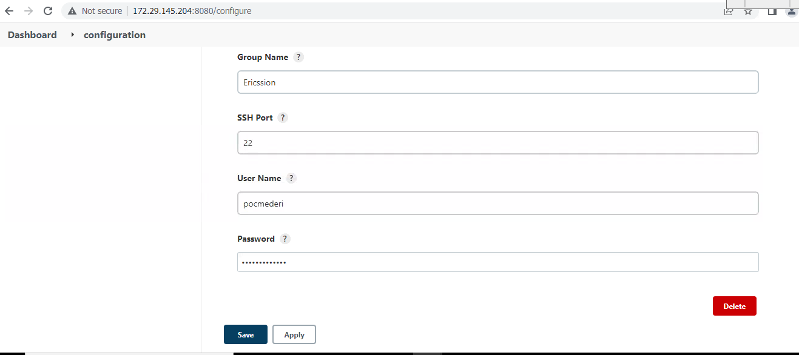
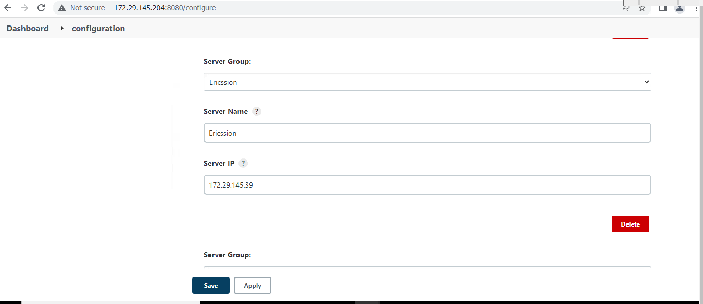
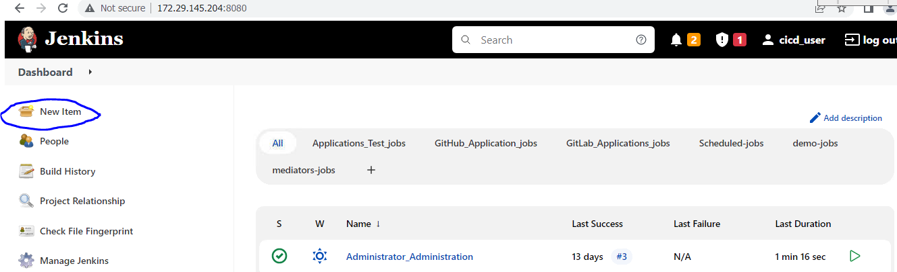
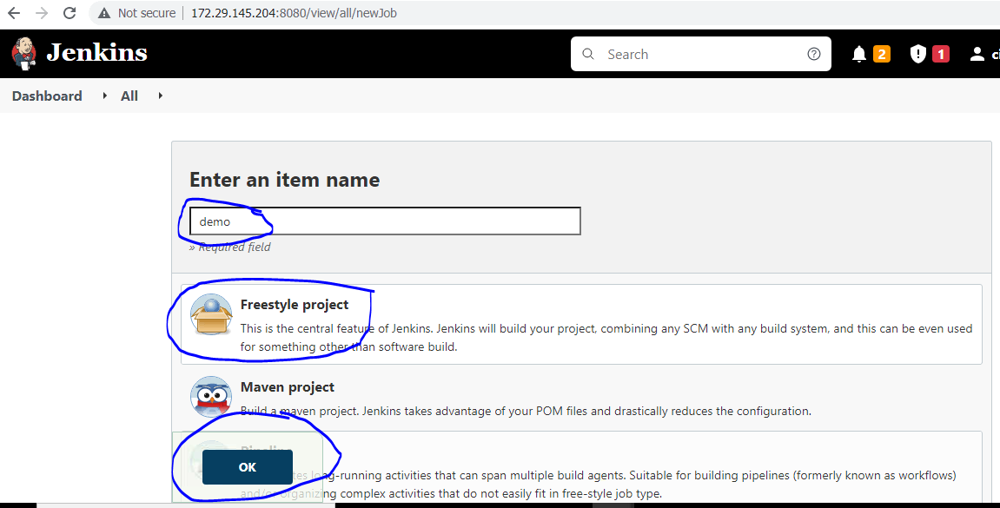
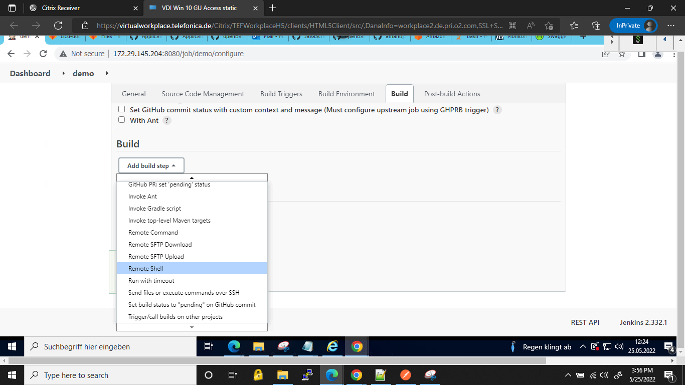
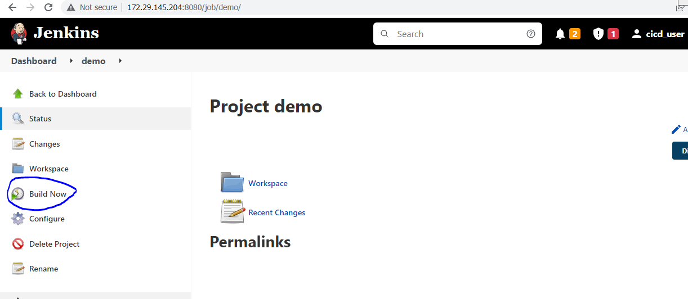
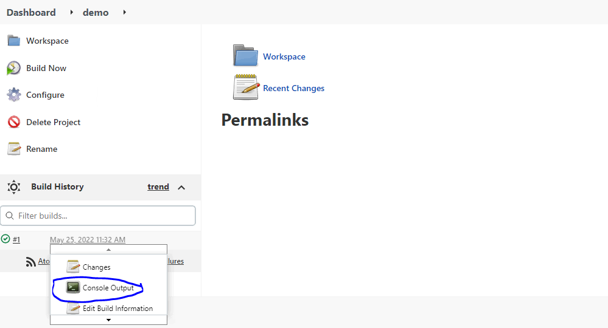
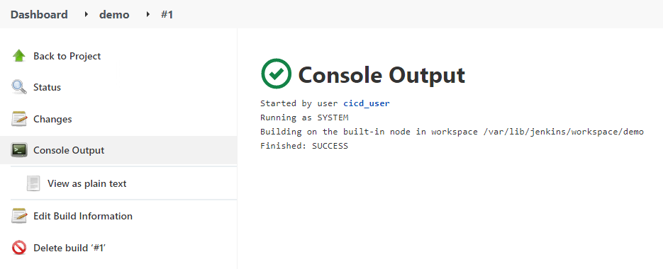
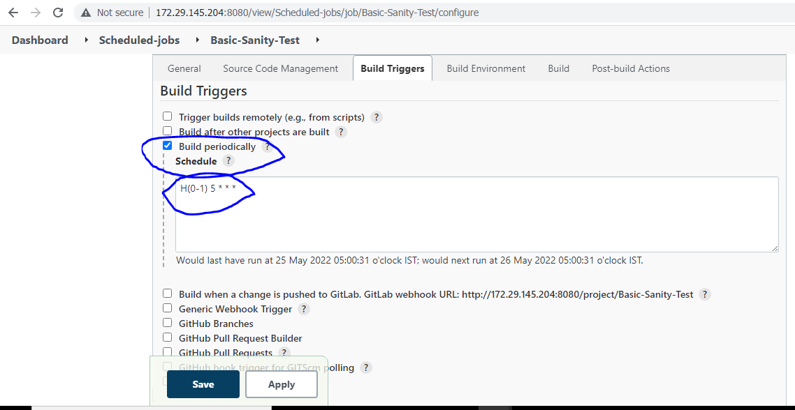
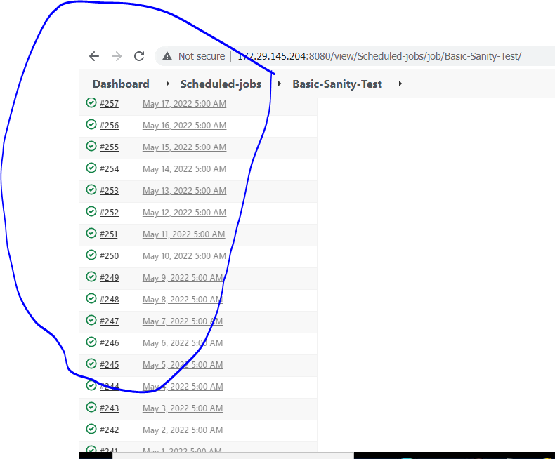

# SDN_Mediator_Jenkins_job

Table of contents:

1.  First configure **server group centers** and **servers list** in
    Jenkins **configure system** section

2.  After configuration, we have to create the **free style** project in
    Jenkins Dashboard.

## 1. First configure **server group centers** and **servers list** in
Jenkins **configure system** section.

Note: Before we add group centers and server list we have to make SSH
connection between these servers with Jenkins server.

**Configure server group centers:**

In **Jenkins Dashboard** left hand side click on the **Manage Jenkins**
and Under **system configuration** select **configure system**.

Goto the **server group center** and add **server group list** like
below screenshot.

Then click on the save button to save the server group list.

**Configure servers list:**

After creating server group centers then Goto the same configure system
and Goto the servers list sections and add server details according to
group of servers earlier we added.

## 2. Create the **free style project** in Jenkins Dashboard

In Jenkins Dashboard, left hand side menu click on the **New Item.**

Then enter the Item name (Job name), select Freestyle Project and click
on ok button to create Freestyle project in Jenkins.

Then open the previously created freestyle project and under **Build
section** select **Remote shell** and select which server we have to
execute Jenkins job.

Then add the commands whatever we have to perform on target server and
click on apply, save button to save the job configurations.

After saving the Job configuration under job section left hand side
menu, we have **built now** option available click on this to **build
the Jenkins Job** as per our configuration.

After building the Jenkins job we can check the Job console output by
following way in Job section.

Here we are looking at the Job build status.

# Scheduled_Jenkins_Jobs

**Instead of running a job based on an event, you may want to run it at
specific times**. For example, if an application build needs a
significant amount of system resources, you may only want to run it
overnight so that your build systems are free for your development teams
during the day.

Scheduling Jobs are created for daily, Nightly and weekly builds.

As per our requirement we scheduled Jenkins jobs.

In our Project we configured scheduled jobs for running sanity and
extended sanity test cases on a daily basis.

## **Create the free style project in Jenkins Dashboard**

In Jenkins Dashboard, left hand side menu click on the **New Item.**

Then enter the Item name (Job name), select Freestyle Project and click
on ok button to create Freestyle project in Jenkins.

Then open the previously created freestyle project and under **Build
Trigger section** select **Build periodically** and schedule the time
for daily auto running job.

Goto the **Build section** select **Remote shell** and select which
server we have to execute Jenkins job.

Then add the commands whatever we have to perform on target server and
click on apply, save button to save the job configurations.

After saving the Job configuration under job section left hand side
menu, we have **built now** option available click on this to **build
the Jenkins Job** as per our configuration.

After building the Jenkins job we can check the Job console output by
following way in Job section.

Here we are looking at the Job build status.

Here once we configured scheduling Jenkins job it builds automatically
as per mentioned timings.

[<- Back to Pipeline Job For Application Deployment](../Jenkins_Jobs/SDN_Application_Deployment_Through_CI-CD.md) - - - [Up to Main](../main.md) - - - [Ahead to Jenkins PollSCM Jobs ->](../Jenkins_Jobs/Jenkins-pollSCM-PipelineJob.md)
