# Create/Add Users in Jenkins & Manage Permissions

Generally, in a large organization, there are multiple, separate teams
to manage and run jobs in Jenkins. But managing this crowd of users and
assigning roles to them can prove troublesome.

By default, Jenkins comes with very basic user creation options. You can
create multiple users but can only assign the same global roles and
privileges to them. This is not ideal, especially for a large
organization.

The Role Strategy Plugin enables you to assign different roles and
privileges to different users. You will first need to install the plugin
in your Jenkins manager environment.

## About this plugin

The Role **Strategy** plugin is meant to be used from
[Jenkins](https://jenkins.io/) to add a new role-based mechanism to
manage users' permissions. Supported features

-   Creating global roles, such as admin, job creator, anonymous, etc.,
    allowing to set Overall, Agent, Job, Run, View and SCM permissions
    on a global basis.

<!-- -->

-   Creating project roles, allowing to set only Job and Run permissions
    on a project basis.

<!-- -->

-   Creating agent roles, allowing to set node-related permissions.

<!-- -->

-   Assigning these roles to users and user groups

<!-- -->

-   Extending role and permissions matching via [Macro
    extensions](https://github.com/jenkinsci/role-strategy-plugin/blob/master/docs/MACROS.md)

**In this document we will learn about the following things:**

1.  Install Role Strategy Plugin in Jenkins.

2.  Enabling plugin in Global security section.

3.  Create/Add a User in Jenkins.

4.  Manage Users and Roles in Jenkins

5.  Assign Roles in Jenkins.

6.  Create Project Roles in Jenkins.

7.  Config & Assign role by using Jenkins Script Console or Groovy Hook
Script

**A. Install Role strategy Plugin in Jenkins**

Step 1:

There are two methods for installing plugins in Jenkins:

1.  Installing it through our Jenkins dashboard

2.  Downloading the plugin from Jenkins website and installing it
    manually.

Installing it through our Jenkins dashboard:

First login into Jenkins.

Then under Jenkins Dashboard we have the option

-   Goto Manage Jenkins

-   Click on Manage Plugins option

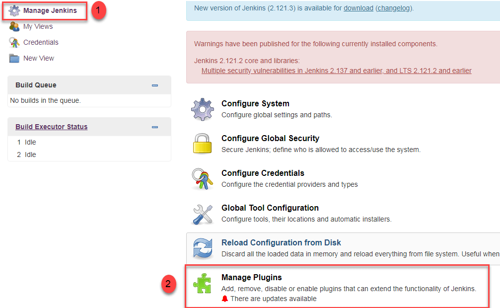

-   In the available section, screen Search for “role”.

-   Select Role**-based Authorization Strategy** plugin

-   Click on “**Install without restart**” (make sure you have an active
    internet connection)

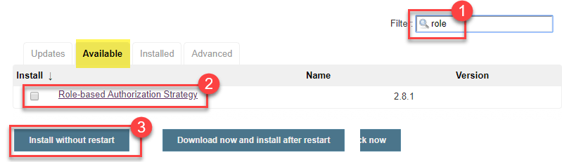

-   Once the plugin is installed, a “success” status will be displayed.

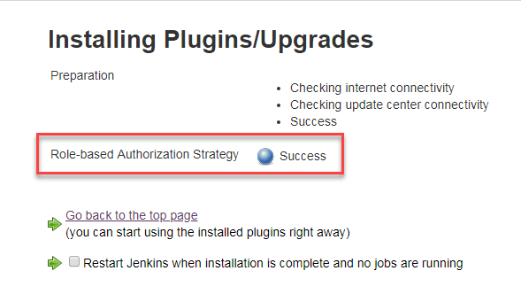

Here in second option, we have to install plugin through official
Jenkins plugins website after that under manage plugins ==\> click on
the advanced section ==\> Goto the Deploy Plugin section click on choose
file and select plugin which was downloaded earlier.

Referral url:

<https://updates.jenkins-ci.org/download/plugins/>

**B. Enabling plugin in Global security section**

Click on **Go back to the top page.**

Go to **Manage Jenkins -\>** Configure Global Security -\> Under
**Authorization,** select **Role Based Strategy**. Click on **Save**.

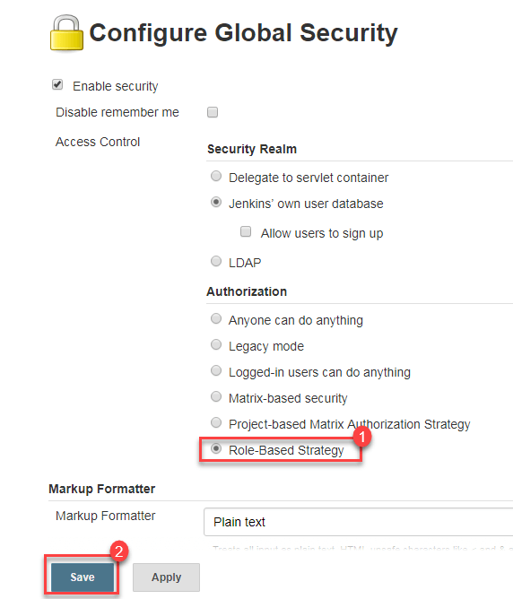

**C. Create a User in Jenkins**

Goto **Manage Jenkins** ==\> under **security** section click on
**Manage users** ==\> here click on **create user**

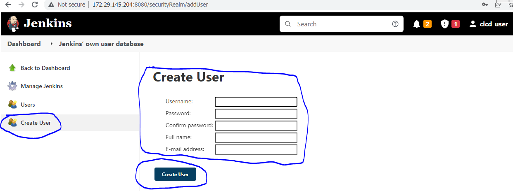

You will see on the dashboard that a new Jenkins created user as per the
details entered.

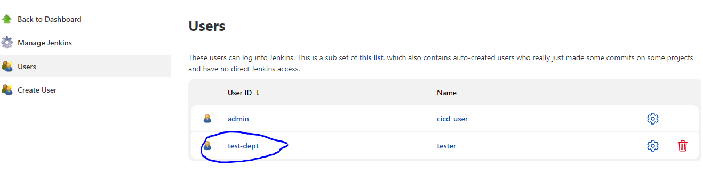

**D. Manage Users and Roles in Jenkins**

You can define roles by using the *Manages Roles* screen. It is possible
to define global and project/agent-specific roles.

Configuring Roles:

-   Global roles apply to any item in Jenkins and override *anything*
    you specify in the Project Roles. That is, when you give a role the
    right to Job-Read in the Global Roles, then this role is allowed to
    read all Jobs, no matter what you specify in the Project Roles.

-   For project and agent roles you can set a regular expression pattern
    for matching items. The regular expression aimed at matching the
    full item name.

    -   For example, if you set the field to Roger-.\*, then the role
        will match all jobs which name starts with Roger-.

    -   Patterns are case-sensitive. To perform a case-insensitive
        match, use (?i) notation: upper, Roger-.\* vs. lower, roger-.\*
        vs. case-insensitive, (?i)roger-.\*.

    -   Folders can be matched using expressions like ^foo/bar.\*

Following are the steps on how to manage and assign roles in Jenkins:

-   Go to **Manage Jenkins**

-   Under security section Select **Manage and Assign Roles**

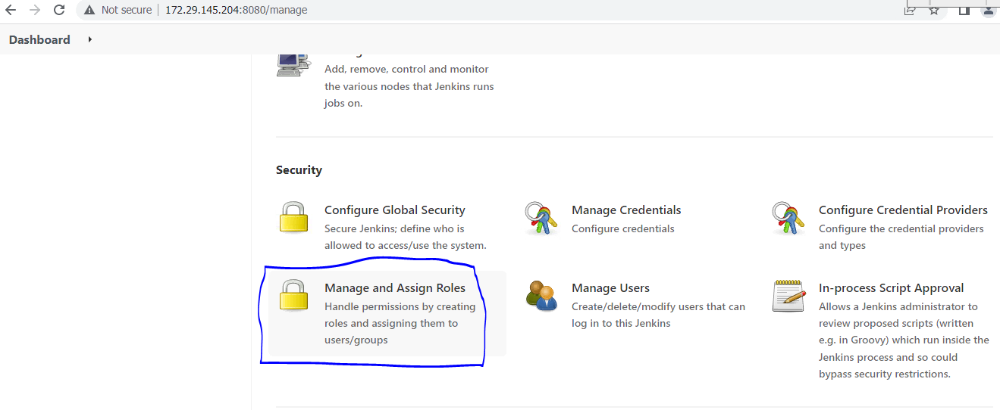

**Note:** that the **Manage and Assign Roles** option will only be
visible if you’ve installed the role strategy plugin.

-   Click on **Manage Roles** to add new roles based on your
    organization.

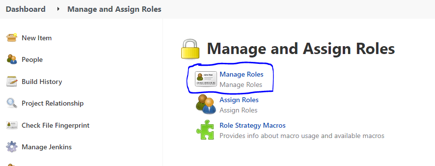

To create a new role called “tester”,

-   Type “tester” under “role”.

-   Click on “Add” to create a new role.

-   Now, select the Jenkins user permissions you want to assign to the
“tester” role.

-   Click Save

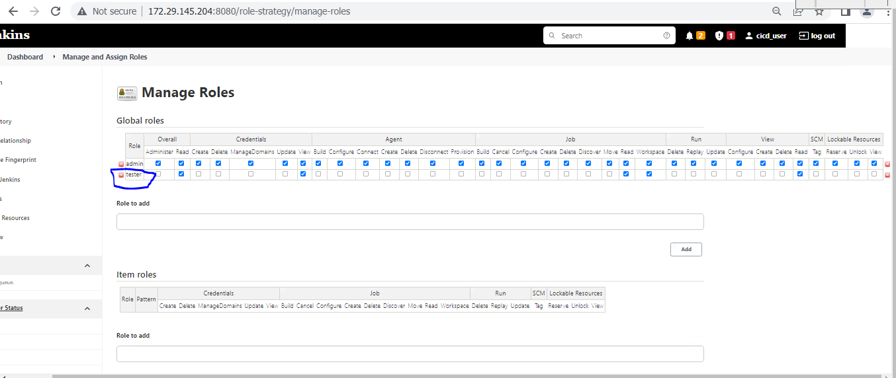

**E. Assign Roles in Jenkins**

You can assign roles to users and user groups using the *Assign Roles*
screen

-   User groups represent authorities provided by the Security Realm
    (e.g. LDAP plugin can provide groups)

-   There are also two built-in groups: authenticated (users who logged
    in) and anonymous (any users, including ones who have not logged in)

Now that you have created roles, let us assign them to specific users.

-   Go to **Manage Jenkins**

-   Select Manage and Assign Roles

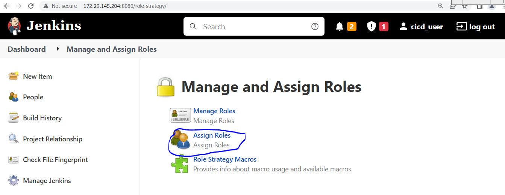

We shall add the new role “tester” to user “tester”

-   Selector tester role checkbox

-   Click Save

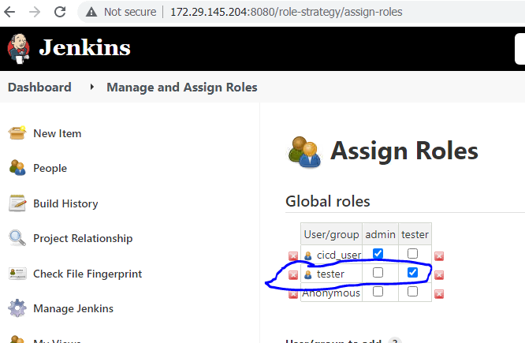

We can assign any role to any user, as per your need.

**F. Create Project Roles in Jenkins**

We can create project specific roles under **Project Roles.**

In Jenkin’s Manage and Assign Roles

-   Enter a role as “tester”

-   Add a pattern to this by adding **tester.\***, so that any username
starting with “tester” will be assigned the project role you
specify.

-   Click Add

-   Select privileges

-   Click Save

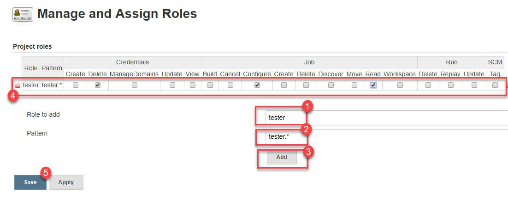

**G. Config & Assign role by using Jenkins Script Console or Groovy Hook Script**

Configuration management can be used via [Jenkins Script
Console](https://www.jenkins.io/doc/book/managing/script-console/) or
[Groovy Hook
Scripts](https://www.jenkins.io/doc/book/managing/groovy-hook-scripts/),
following example is creating a admin role & user based on plugin 3.1.

import jenkins.model.Jenkins  
  
import hudson.security.PermissionGroup  
import hudson.security.Permission  
  
import
com.michelin.cio.hudson.plugins.rolestrategy.RoleBasedAuthorizationStrategy  
import com.michelin.cio.hudson.plugins.rolestrategy.Role  
import com.synopsys.arc.jenkins.plugins.rolestrategy.RoleType  
  
import org.jenkinsci.plugins.rolestrategy.permissions.PermissionHelper  
  
Jenkins jenkins = Jenkins.get()  
def rbas = new RoleBasedAuthorizationStrategy()  
  
/\* create admin role \*/  
Set\<Permission\> permissions = new HashSet\<\>();  
def groups = new ArrayList\<\>(PermissionGroup.getAll());  
groups.remove(PermissionGroup.get(Permission.class));  
Role adminRole = new Role("admin",permissions)  
  
/\* assign admin role to admin user \*/  
globalRoleMap = rbas.getRoleMaps()\[RoleType.Global\]  
globalRoleMap.addRole(adminRole)  
globalRoleMap.assignRole(adminRole, 'admin')  
  
jenkins.setAuthorizationStrategy(rbas)  
  
jenkins.save()

**Referral URLs:**

[**https://plugins.jenkins.io/role-strategy/**](https://plugins.jenkins.io/role-strategy/)

[**https://www.guru99.com/create-users-manage-permissions.html**](https://www.guru99.com/create-users-manage-permissions.html)

[<- Back to Docker Installation](../Installation/Docker-installation-in-REHL8.md) - - - [Up to Main](../main.md) - - - [Ahead to Email Notifications ->](../Jenkins_Emails/Email-Notification-In-Jenkins.md)
