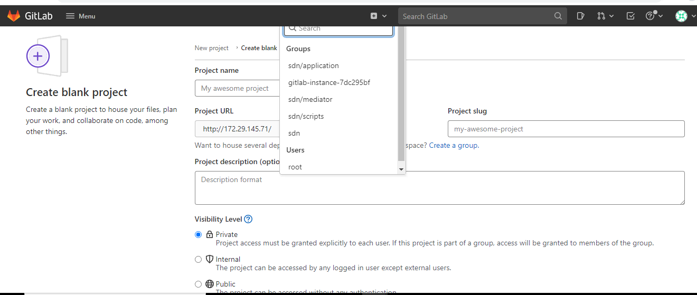

# 5. Groups and projects in GitLab: 

 

In GitLab, you use groups to manage one or more related projects at the same time. 

You can use groups to manage permissions for your projects. If someone has access to the group, they get access to all the projects in the group. 

You can also view all of the issues and merge requests for the projects in the group, and view analytics that show the group’s activity. 

You can use groups to communicate with all of the members of the group at once. 

For larger organizations, you can also create subgroups. 

## 5.1. View groups 

To view groups: 

On the top bar, select Menu > Groups. 

Select Your Groups. All groups you are a member of are displayed. 

To view a list of public groups, select Explore public groups. 

You can also view groups by namespace. 

## 5.2. Group visibility 

Like projects, a group can be configured to limit the visibility of it to: 

Anonymous users. 

All signed-in users. 

Only explicit group members. 

The restriction for visibility levels on the application setting level also applies to groups. If set to internal, the explore page is empty for anonymous users. The group page has a visibility level icon. 

Administrator users cannot create a subgroup or project with a higher visibility level than that of the immediate parent group. 

## 5.3. Create a group 

To create a group: 

On the top bar, either: 

Select Menu > Groups, and on the right, select Create group. 

To the left of the search box, select the plus sign and then New group. 

Select Create group. 

Enter a name for the group in Group name. For a list of words that cannot be used as group names, see reserved names. 

Enter a path for the group in Group URL, which is used for the namespace. 

Choose the visibility level. 

Personalize your GitLab experience by answering the following questions: 

What is your role? 

Who will be using this group? 

What will you use this group for? 

Invite GitLab members or other users to join the group. 

 For details about groups, watch GitLab Namespaces (users, groups and subgroups). 

 

## 5.4. Add projects to a group 

 

There are two different ways to add a new project to a group: 

Select a group, and then select a new project. You can then continue creating your project. 

While you are creating a project, select a group from the dropdown list. 

Select projects and on the right-side top click on the new project and select create blank project then enter project details and select group from the list. 

 

 

 

Referral links: 

https://docs.gitlab.com/ee/user/group/ 

 

## 5.5 Implementing permissions 

There are multiple types of permissions across GitLab, and when implementing anything that deals with permissions, all of them should be considered. 

Instance 

User types: 

Each user can be one of the following types: 

Regular. 

External - access to groups and projects only if direct member. 

Internal users - system created. 

Auditor: 

No access to projects or groups settings menu. 

No access to Admin Area. 

Read-only access to everything else. 

Administrator - read-write access. 

 

 

Groups and Projects: 

General permissions 

Groups and projects can have the following visibility levels: 

public - an entity is visible to everyone 

internal - an entity is visible to logged in users 

private - an entity is visible only to the approved members of the entity 

By default, subgroups cannot have higher visibility levels. For example, if you create a new private group, it cannot include a public subgroup. 

The visibility level of a group can be changed only if all subgroups and sub-projects have the same or lower visibility level. For example, a group can be set to internal only if all subgroups and projects are internal or private. 

Members 

Users can be members of multiple groups and projects. The following access levels are available (defined in the Gitlab::Access module): 

No access (0) 

Minimal access (5) 

Guest (10) 

Reporter (20) 

Developer (30) 

Maintainer (40) 

Owner (50) 

If a user is the member of both a project and the project parent group, the higher permission is taken into account for the project. 

If a user is the member of a project, but not the parent groups, they can still view the groups and their entities (like epics). 

Project membership (where the group membership is already taken into account) is stored in the project_authorizations table. 

 

**Referral links:** 

https://docs.gitlab.com/ee/development/permissions.html 

[<- Back to Manage GitLab User Accounts](../Manage_GitLab_User_Accounts/GitLab_User_Actions.md) - - - [Up to Main](../main.md) - - - [Ahead to GitLab Webhook in Jenkins ->](../Other_Configuration_In_GitLab/Configure_GitLab_Webhook_In_Jenkins.md)

