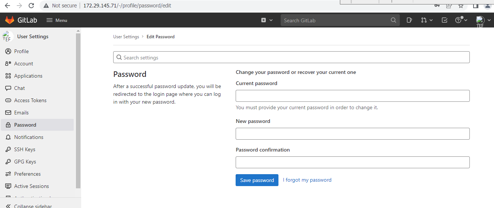
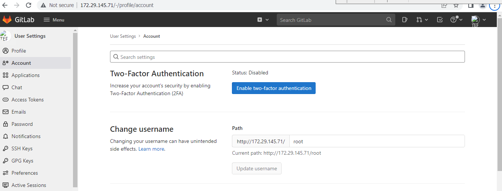
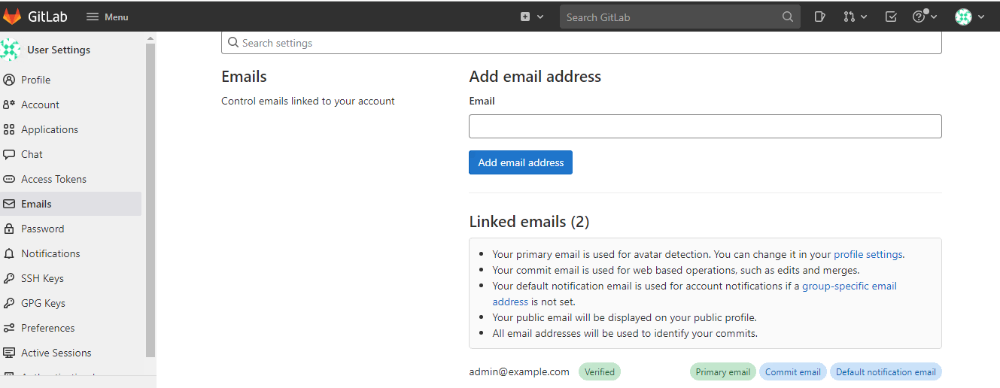
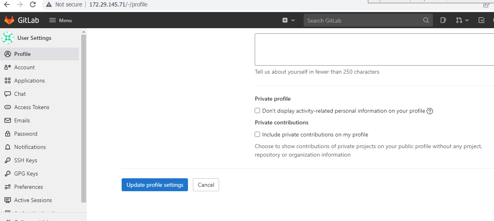

# 4. User Account options 

User account  

Each GitLab account has a user profile, which contains information about you and your GitLab activity. 

Your profile also includes settings, which you use to customize your GitLab experience. 

Access your user profile 

**To access your profile:** 

On the top bar, in the top-right corner, select your avatar. 

Select your name or username. 

Access your user settings 

**To access your user settings:** 

On the top bar, in the top-right corner, select your avatar. 

Select Edit profile. 

## 4.1. Change your password 

To change your password: 

On the top bar, in the top-right corner, select your avatar. 

Select Edit profile. 

On the left sidebar, select Password. 

In the Current password text box, enter your current password. 

In the New password and Password confirmation text box, enter your new password. 

Select Save password. 

If you don’t know your current password, select the I forgot my password link. 

## 4.2. Change your username 

Your username has a unique namespace, which is updated when you change your username. Before you change your username, read about how redirects behave. If you do not want to update the namespace, you can create a new user or group and transfer projects to it instead. 

**Prerequisites:** 

Your namespace cannot contain a project with Container Registry tags. 

Your namespace cannot have a project that hosts GitLab Pages. For more information, see this procedure in the GitLab Team Handbook. 

## 4.3. To change your username 

On the top bar, in the top-right corner, select your avatar. 

Select Edit profile. 

On the left sidebar, select Account. 

In the Change username section, enter a new username as the path. 

Select Update username. 

 

## 4.4. Add emails to your user profile 

**To add new email to your account:** 

On the top bar, in the top-right corner, select your avatar. 

Select Edit profile. 

On the left sidebar, select Emails. 

In the Email text box, enter the new email. 

Select Add email address. 

Verify your email address with the verification email received. 

## 4.5. Make your user profile page private 

 

You can make your user profile visible to only you and GitLab administrators. 

**To make your profile private:** 

On the top bar, in the top-right corner, select your avatar. 

Select Edit profile. 

Select the Private profile checkbox. 

Select Update profile settings. 

The following is hidden from your user profile page (http://172.29.145.71/-/profile): 

Atom feed 

Date when account was created 

Tabs for activity, groups, contributed projects, personal projects, starred projects, snippets 

Making your user profile page private does not hide all your public resources from the REST or GraphQL APIs. 

User visibility 

The public page of a user, located at /username, is always visible whether you are signed-in or not. 

When visiting the public page of a user, you can only see the projects which you have privileges to. 

If the public level is restricted, user profiles are only visible to signed-in users. 

## 4.6. Add details to your profile with README 

 

Introduced in GitLab 14.5. 

You can add more information to your profile page with a README file. When you populate the README file with information, it’s included on your profile page. 

From a new project 

**To create a new project and add its README to your profile: **

On the top bar, select Menu > Project. 

Select Create a new project. 

Select Create blank project. 

**Enter the project details:** 

In the Project name field, enter the name for your new project. 

In the Project URL field, select your GitLab username. 

In the Project slug field, enter your GitLab username. 

For Visibility Level, select Public.Proper project path for an individual on the hosted product 

For Project Configuration, ensure Initialize repository with a README is selected. 

Select Create project. 

Create a README file inside this project. The file can be any valid README or index file. 

Populate the README file with Markdown, or another supported markup language. 

GitLab displays the contents of your README below your contribution graph. 

From an existing project 

To add the README from an existing project to your profile, update the path of the project to match your username. 

**Referral links:**

https://docs.gitlab.com/ee/user/profile/ 

[<- Back to Manage GitLab Users](../Manage_GitLab_Users/Manage_Users.md) - - - [Up to Main](../main.md) - - - [Ahead to Manage GitLab Groups and Projects ->](../Manage_GitLab_Groups_And_Projects/Groups_And_Projects.md)
