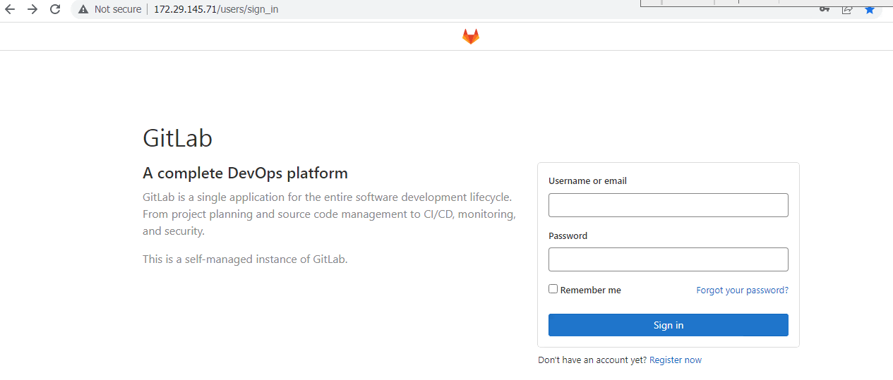
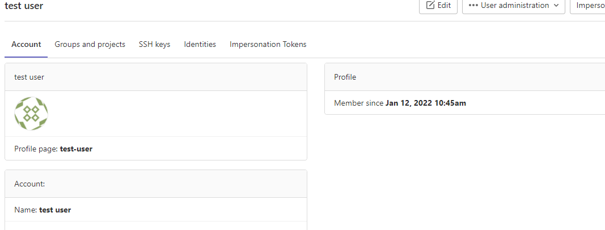
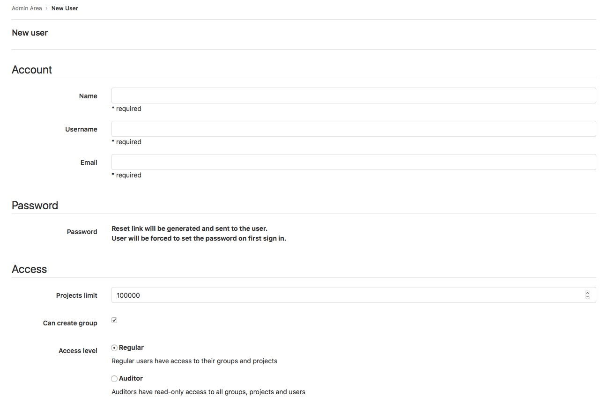

# 3. Create and manage users in GitLab 

 

## 3.1. Creating users: 

 

**We can create users:** 

Manually through the sign in page or Administrator Area. 

Automatically through user authentication integrations. 

Create users on sign in page 

If you have sign-up enabled, users can create their own accounts by either: 

Selecting the Register now link on the sign-in page. 

Navigating to http://172.29.145.71/users/sign_in 

After registering, login with Admin user credentials and on the top bar, select Menu > Admin. 

In Dashboard under Latest users select user which was created earlier. 

Under user on top right side, we have user administration menu click on this and select approve for user confirmation. 

 

**Create users in Admin Area:**

As an Administrator user, you can manually create users: 

On the top bar, select Menu > Admin. 

On the left sidebar, select Overview > Users (/admin/users). 

Select New user. 

You can also create users through the API as an administrator. 

 

 

**Referral links:** 

https://docs.gitlab.com/ee/user/profile/account/create_accounts.html 

 

## 3.2. Add users to a project: 

Add users to a project so they become members and have permission to perform actions. The Owner role can only be added at the group level. 

**Prerequisite:** 

You must have the Maintainer or Owner role. 

To add a user to a project: 

On the top bar, select Menu > Projects and find your project. 

On the left sidebar, select Project information > Members. 

Select Invite members. 

Enter an email address and select a role. 

Optional. Select an Access expiration date. On that date, the user can no longer access the project. 

Select Invite. 

If the user has a GitLab account, they are added to the members list. If you used an email address, the user receives an email. 

If the invitation is not accepted, GitLab sends reminder emails two, five, and ten days later. Unaccepted invites are automatically deleted after 90 days. 

If the user does not have a GitLab account, they are prompted to create an account using the email address the invitation was sent to. 

## 3.3. Add groups to a project: 

When you add a group to a project, each user in the group gets access to the project. Each user’s access is based on: 

The role they’re assigned in the group. 

The maximum role you choose when you invite the group. 

**Prerequisite:** 

You must have the Maintainer or Owner role. 

Sharing the project with other groups must not be prevented. 

To add groups to a project: 

On the top bar, select Menu > Projects and find your project. 

On the left sidebar, select Project information > Members. 

Select Invite a group. 

Select a group. 

Select the highest role for users in the group. 

Optional. Select an Access expiration date. On that date, the group can no longer access the project. 

Select Invite. 

The members of the group are not displayed on the Members tab. The Members tab shows: 

Members who are directly assigned to the project. 

If the project was created in a group namespace, members of that group. 

## 3.4. Import users from another project: 

You can import another project’s users to your own project. Users retain the same permissions as the project you import them from. 

**Prerequisite:**

You must have the Maintainer or Owner role. 

**To import users:**

On the top bar, select Menu > Projects and find your project. 

On the left sidebar, select Project information > Members. 

Select Import from a project. 

Select the project. You can view only the projects for which you’re a maintainer. 

Select Import project members. 

After the success message displays, refresh the page to view the new members. 

## 3.5. Remove a member from  a project: 

If a user is a direct member of a project, you can remove them. If membership is inherited from a parent group, then the member can be removed only from the parent group itself. 

**Prerequisites:** 

You must have the Owner role. 

Optional. Unassign the member from all issues and merge requests that are assigned to them. 

To remove a member from a project: 

On the top bar, select Menu > Projects and find your project. 

On the left sidebar, select Project information > Members. 

Next to the project member you want to remove, select Remove member. 

Optional. In the confirmation box, select the Also unassign this user from related issues and merge requests checkbox. 

To prevent leaks of sensitive information from private projects, verify the user has not forked the private repository or created webhooks. Existing forks continue to receive changes from the upstream project, and webhooks continue to receive updates. You may also want to configure your project to prevent projects in a group from being forked outside their group. 

Select Remove member. 

**Referral links:** 

https://docs.gitlab.com/ee/user/project/members/ 

 

## 3.6. Reset user’s password: 

Use a Rails console 

If you know the username, user ID, or email address, you can use the Rails console to reset their password: 

Open a Rails console. 

**Find the user:** 

**By username:** 

user = User.find_by_username 'exampleuser' 
 

**By user ID:** 

user = User.find(123) 
 

**By email address:** 

user = User.find_by(email: 'user@example.com') 
 

Reset the password by setting a value for user.password and user.password_confirmation. For example, to set a new random password: 

new_password = ::User.random_password 
user.password = new_password 
user.password_confirmation = new_password 
 

Optional. Notify the user that an administrator changed their password: 

user.send_only_admin_changed_your_password_notification! 
 

**Save the changes:** 

user.save! 
 

**Exit the console**: 

exit 
 

**Reset the root’s password:** 

 

To reset the root password, follow the steps listed previously. 

If the root account name hasn’t changed, use the username root. 

If the root account name has changed and you don’t know the new username, you might be able to use a Rails console with user ID 1. In almost all cases, the first user is the default administrator account. 

**Troubleshooting:** 

 

If the new password doesn’t work, it might be an email confirmation issue. You can attempt to fix this issue in a Rails console. For example, if a new root password isn’t working: 

Start a Rails console. 

Find the user and skip reconfirmation: 

user = User.find(1) 
 user.skip_reconfirmation! 
 

Attempt to sign in again. 

**Referral links:** 

https://docs.gitlab.com/ee/security/reset_user_password.html 

 

## 3.7. Deleting a user account: 

Users can be deleted from a GitLab instance, either by: 

The user themselves. 

An administrator. 

Note: Deleting a user deletes all projects in that user namespace. 

Delete your own account 

As a user, to delete your own account: 

On the top bar, in the top right corner, select your avatar. 

Select Edit profile. 

On the left sidebar, select Account. 

Select Delete account. 

**Delete users and user contributions:** 

 

**As an administrator, to delete a user account:** 

On the top bar, select Menu > Admin. 

On the left sidebar, select Overview > Users. 

Select a user. 

**Under the Account tab, select:** 

Delete user to delete only the user but maintain their associated records. You can’t use this option if the selected user is the sole owner of any groups. 

Delete user and contributions to delete the user and their associated records. This option also removes all groups (and projects within these groups) where the user is the sole direct Owner of a group. Inherited ownership doesn’t apply. 

Using the Delete user and contributions option may result in removing more data than intended. See associated records for additional details. 

Associated records 

**When deleting users, you can either:** 

Delete just the user. Not all associated records are deleted with the user. Instead of being deleted, these records are moved to a system-wide user with the username Ghost User. The Ghost User’s purpose is to act as a container for such records. Any commits made by a deleted user still display the username of the original user. 

**Delete the user and their contributions, including:** 

Abuse reports. 

Award emojis. 

Epics. 

Groups of which the user is the only user with the Owner role. 

Issues. 

Merge requests. 

Notes and comments. 

Personal access tokens. 

Snippets. 

An alternative to deleting is blocking a user. 

When a user is deleted from an abuse report or spam log, these associated records are always removed. 

The deleting associated records option can be requested in the API as well as the Admin Area. 

**Referral links:** 

https://docs.gitlab.com/ee/user/profile/account/delete_account.html 

 

## 3.8. Add users to a group 

You can give a user access to all projects in a group. 

On the top bar, select Menu > Groups and find your group. 

On the left sidebar, select Group information > Members. 

Select Invite members. 

Fill in the fields. 

The role applies to all projects in the group. Learn more about permissions. 

On the Access expiration date, the user can no longer access projects in the group. 

Select Invite. 

Members that are not automatically added are displayed on the Invited tab. Users can be on this tab because they: 

Have not yet accepted the invitation. 

Are waiting for approval from an administrator. 

Exceed the group user cap. 

[<- Back to GitLab Installation](../Installation/GitLab_Installation.md) - - - [Up to Main](../main.md) - - - [Ahead to Manage GoitLab User Accounts ->](../Manage_GitLab_User_Accounts/GitLab_User_Actions.md)
