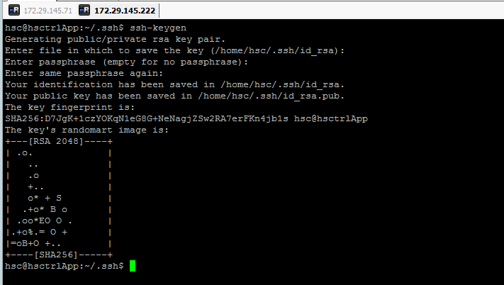
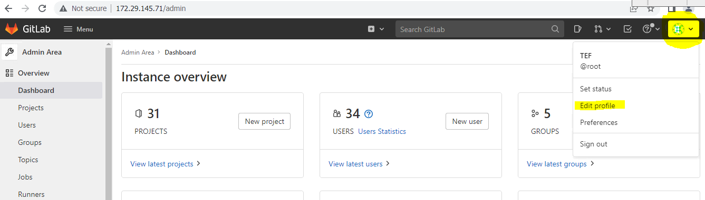
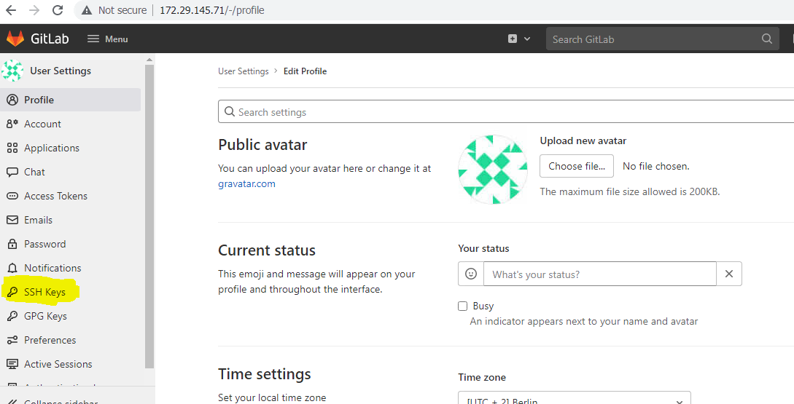
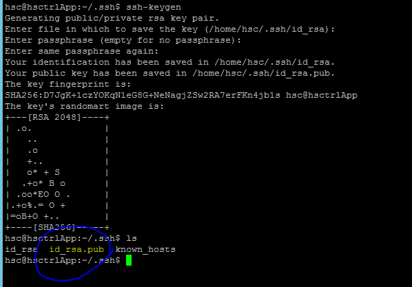
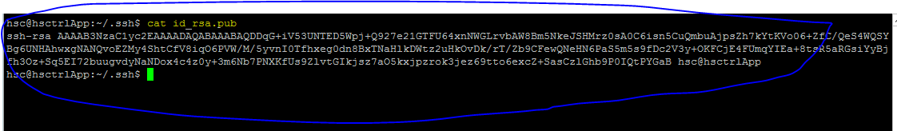
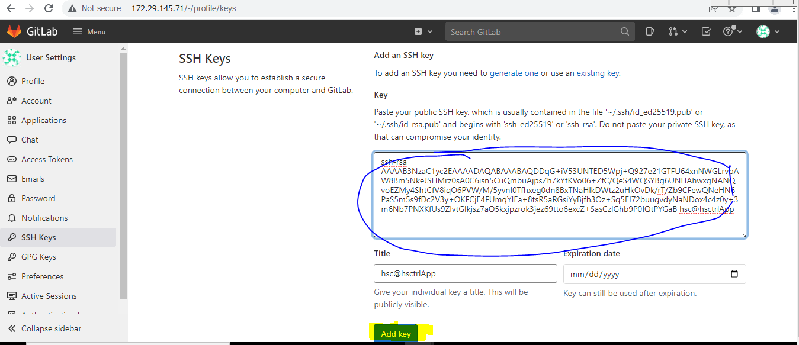
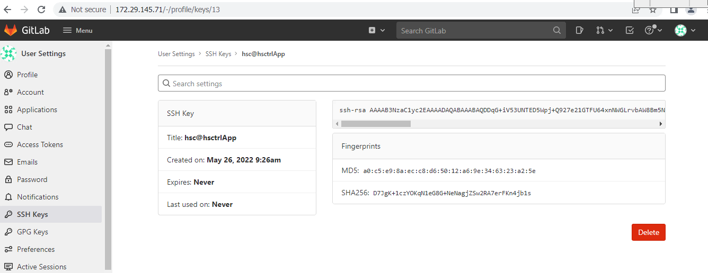

# **7. SSH keys to communicate with GitLab**

Git is a distributed version control system, which means you can work
locally, then share or *push* your changes to a server. In this case,
the server you push to is GitLab.

GitLab uses the SSH protocol to securely communicate with Git. When you
use SSH keys to authenticate to the GitLab remote server, you don’t need
to supply your username and password each time. Before generating ssh
keygen, you need to have Git installed in your system.

Before you create a key pair, see if a key pair already exists.

-   Go to your home directory.

<!-- -->

-   Go to the .ssh/ subdirectory. If the .ssh/ subdirectory doesn’t
    exist, you are either not in the home directory, or you haven’t used
    ssh before. In the latter case, you need to [generate an SSH key
    pair](https://docs.gitlab.com/ee/user/ssh.html#generate-an-ssh-key-pair).

## **Step 1:**

**Generate an SSH key pair**

If you do not have an existing SSH key pair, generate a new one:

-   Open a terminal.

<!-- -->

-   Run **ssh-keygen** followed by the key type and an optional comment.
    This comment is included in the .pub file that’s created. You may
    want to use an email address for the comment.

C:\\−ssh-keygen

It will prompt for 'Enter file in which to save the key
(//.ssh/id_rsa):', just type file name and press enter. Next a prompt to
enter password shows 'Enter passphrase (empty for no passphrase):'.
Enter some password and press enter. You will see the generated SSH key
as shown in the below image.

## **Step 2:**

Now Login to the GitLab Account and on the top right side click on
**Avatar symbol** and select **Edit profile** option.

## **Step 3:**

To Create SSH Key, click on the SSH Keys tab on the left side of the
menu.

## **Step 4:**

Now Go to the server which communicate with GitLab. Goto the .ssh file
path under this folder we have id_rsa.pub file available.

$ cd .ssh

## **Step 5:**

Next open the id_rsa.pub file, copy the SSH key and paste it in the
highlighted *Key* box as shown in the below image.

Here **Expiration date** is optional, if we want to give a particular
time period then that key valid up to mentioned time.

## **Step 6**:

Click on the *Add Key* button, to add SSH key to your GitLab. You will
see the fingerprint (it is a short version of SSH key), title and
created date as shown in the image below.

Now, SSH keys are generated successfully. We can able communicate with
server and GitLab without any credentials.

**Referral links:**

<https://docs.gitlab.com/ee/user/ssh.html>

<https://www.tutorialspoint.com/gitlab/gitlab_ssh_key_setup.htm>

[<- Back to Webhook configuration](../Other_Configuration_In_GitLab/Configure_GitLab_Webhook_In_Jenkins.md) - - - [Back to Main](../main.md)

