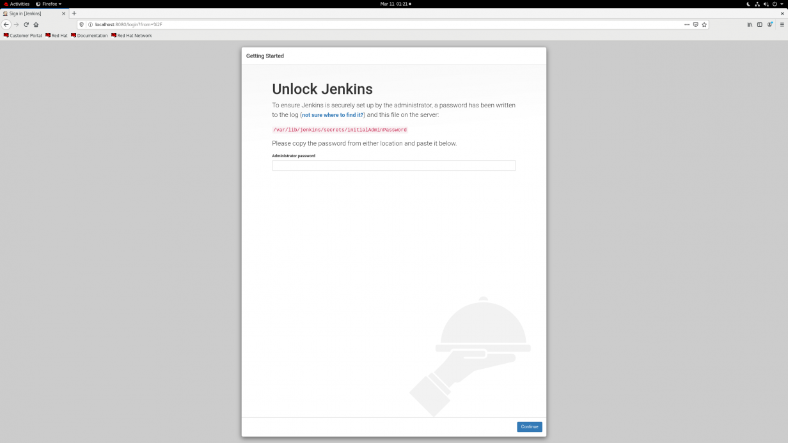
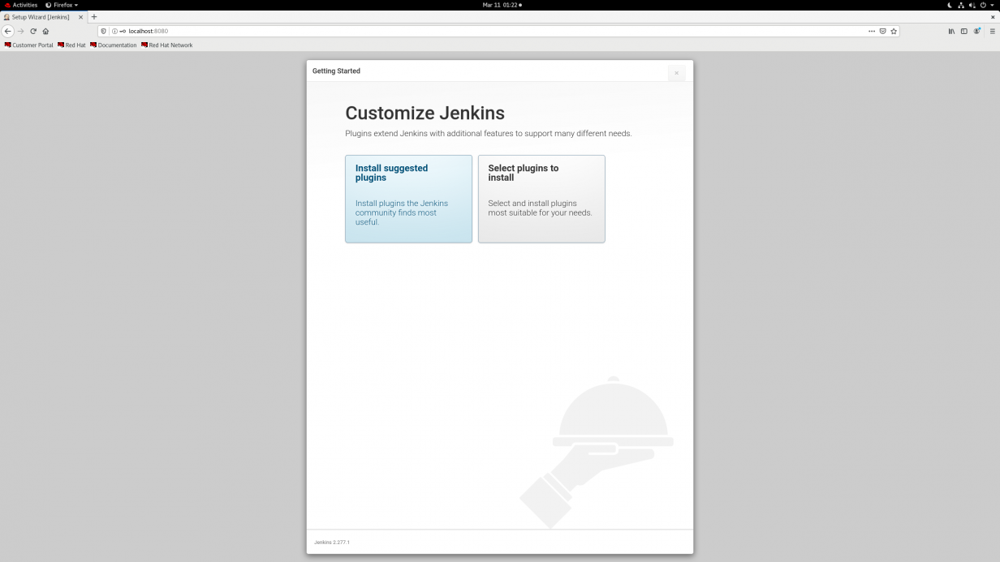
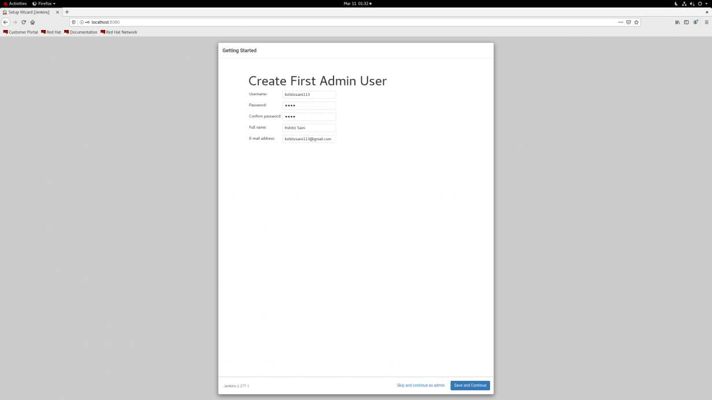
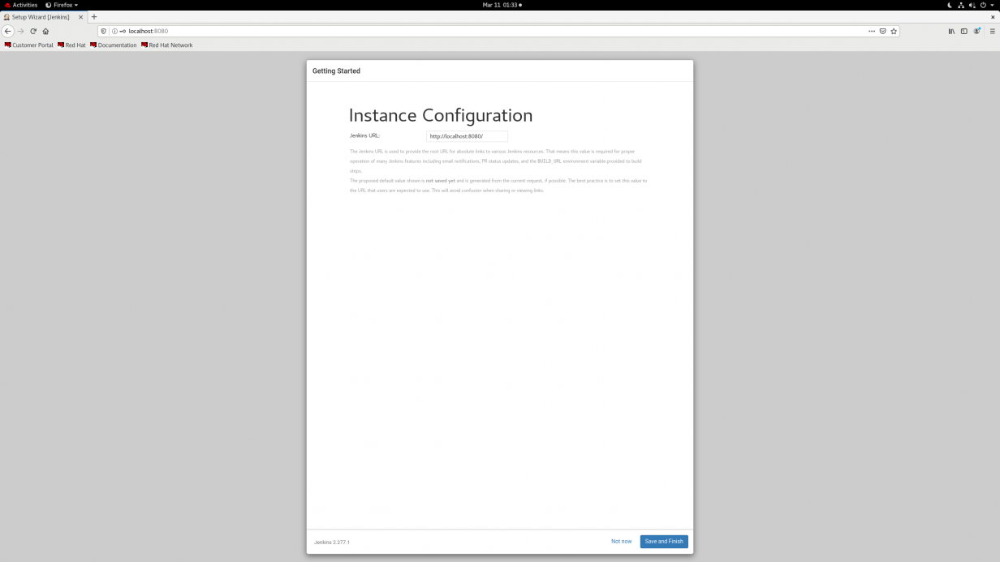
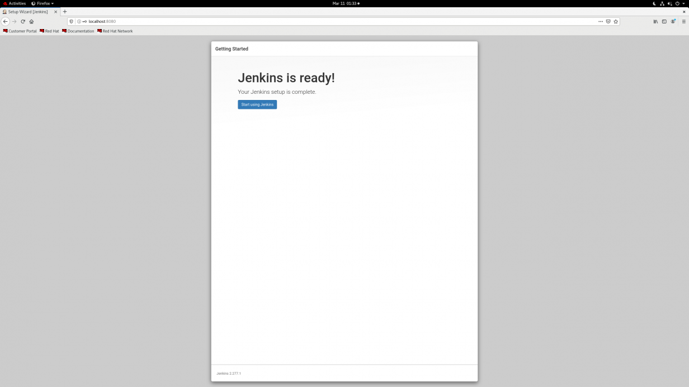

# Jenkins_Installation

**<u>Jenkins-installation-steps</u>**

**For docker package download:**

wget –e use_proxy=yes -e http_proxy=(proxy-ip:8080)
<https://download.docker.com/linux/static/stable/x86_64/docker-20.10.9.tgz>

**For epel-release package download:**

wget –e use_proxy=yes -e http_proxy=(proxy-ip:8080)
<https://dl.fedoraproject.org/pub/epel/epel-release-latest-8.noarch.rpm>

**For jenkins repo download:**

sudo wget –e use_proxy=yes -e http_proxy=(proxy-ip:8080) -O
/etc/yum.repos.d/jenkins.repo
<https://pkg.jenkins.io/redhat/jenkins.repo>

**For importing key:**

rpm --import https://pkg.jenkins.io/redhat-stable/jenkins.io.key
--httpproxy 10.1.17.85 --httpport 8080

**For installing Epel-release:**

rpm -ivh epel-release-latest-8.noarch.rpm

**For installing jenkins:**

yum install jenkins

Systemctl start jenkins

Systemctl status jenkins

**Enabled firewall for 8080** **port:**

Firewall-cmd - -list-all

Firewall-cmd - -add-port=8080/tcp - -permanent

Now, the Jenkins server will be running on port 8080 for our server.

In browser enter: ip-addr:8080

## **Configuring Jenkins:**

You can configure the Jenkins service on port 8080 of your system, but
Jenkins is temporarily locked with a password present in the
/var/lib/jenkins/secrets/initialAdminPassword file. You can access
Jenkins by providing the password after reading the file.

**Image**

Cat path-of-initial-password //**for password retrivel**

Then copy password and paste into jenkins page on browser

**Configuring proxy:**

For installing plugins, we need to configure proxy details here (if we
are using proxy or else not required):

-   Proxy-Ip

-   Proxy port number

Install the suggested plugins for Jenkins. They are compatible with most
versions, but if you want to do something specific, you can also select
and work with the plugins you wish.

The plugins will take some time to install depending on the connectivity
speed, so be patient.

Create an admin user. Make sure you remember the username and password,
as they are the credentials for accessing the Jenkins WebUI.

Specify if you wish to change the port for your Jenkins. It is preferred
to use Jenkins on 8080 ports.

Jenkins setup is complete and it can be accessed with the URL that is
configured for it.

**Referral links:** 

https://www.npmjs.com/package/newman 

https://www.npmjs.com/package/newman-reporter-htmlextra 

[<- Back to Overview](../Overview/Overview.md) - - - [Up to Main](../main.md) - - - [Ahead to Docker Installation ->](../Installation/Docker-installation-in-REHL8.md)
