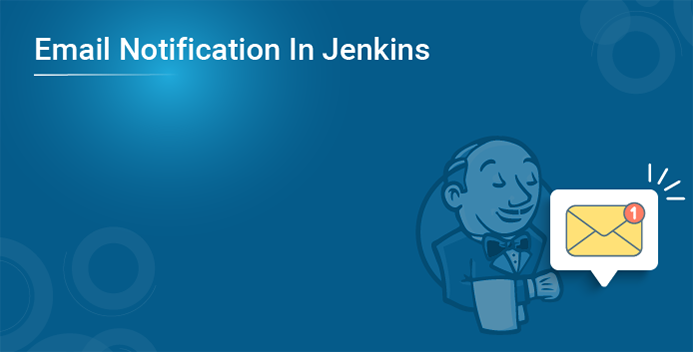
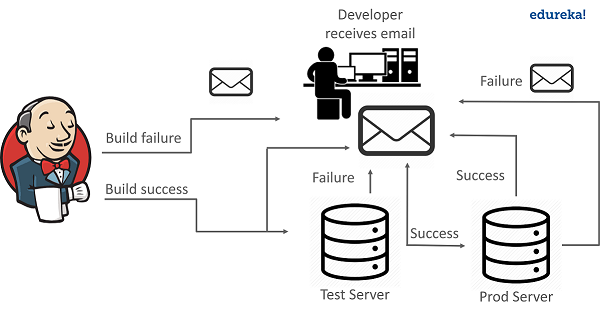
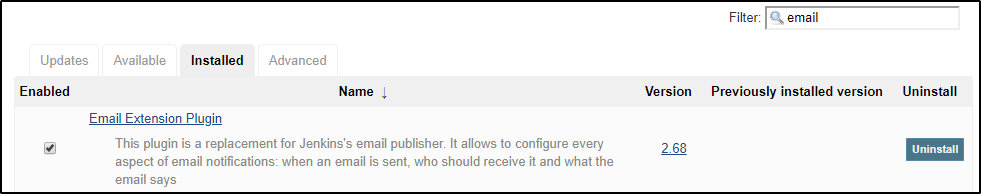
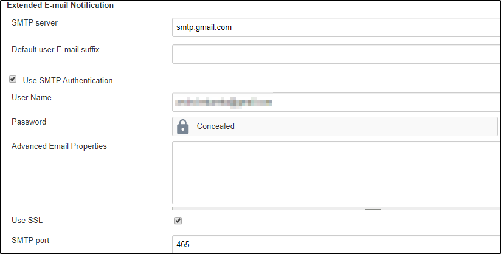
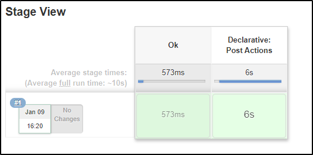
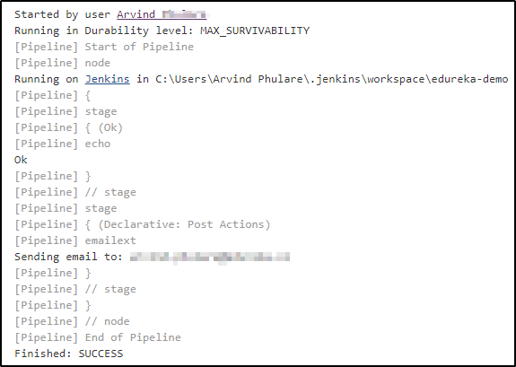
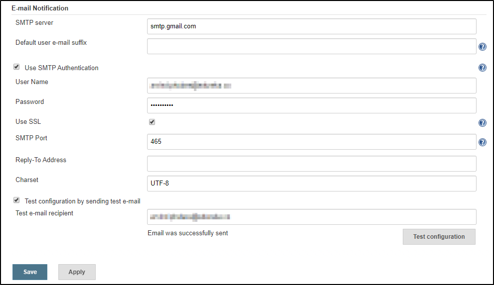
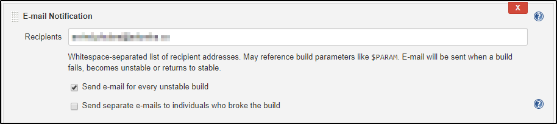
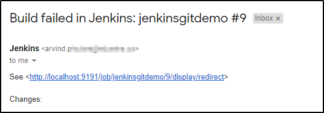

**<u>Email Notification in Jenkins</u>**

Jenkins provides you with an email notification service through which
you can report the build status and testing results to the team.

# **Why do we need email notifications in Jenkins?**

## **Problem Statement:**

-   Suppose the release of the application is scheduled at midnight. Now
    there is a problem with the application on the test server or the
    production servers. Also, there might be a case where the
    application is released and it goes down after a few hours. If the
    application, say for example Netflix is down even for a few minutes,
    this can result in the loss of millions of dollars. Also due to such
    errors, the project deadline might get extended.

# **Solution:**

-   This problem was solved by an automation tool called
    [Jenkins](https://jenkins.io/). Jenkins has a service of Email
    Notifications to handle such situations.

-   If the build is not successful then the team of developers is
    notified about the status of the build. This can be done with the
    help of an Email plugin in Jenkins. **Plugins** are the primary
    means of enhancing the functionality of a **Jenkins** environment to
    suit organization- or user-specific needs.

-   Using the email plugin, you configure the email details of the
    concerned person who should be notified in case of build failure.

-   Once the developer is notified about the error, he then fixes it and
    again commits the code to GitHub. After this Jenkins again pulls the
    code from GitHub and prepares a fresh build.

-   Similarly, Jenkins can solve the problem of the application going
    down after the release, by notifying the concerned team, via email.

Now let us see how to send Email Notifications in Jenkins.

# **How To Send Email Notification In Jenkins?**

There are basically two ways to configure email notifications in
Jenkins.

1.  **Using Email Extension Plugin** — This
    [plugin](https://plugins.jenkins.io/) lets you configure every
    aspect of email notifications. You can customize things such as when
    to send the email, who receives it, and what the email says.

2.  **Using Default Email Notifier** — This comes with Jenkins by
    default. It has a default message consisting of a build number and
    status.

# **Email Extension Plugin**

## **Step 1: Log in to the Jenkins Homepage**

Go to Jenkins home page using the URL localhost:8080. The port number by
default is 8080. In my case, it is 9191. Sign in using your username and
password.

## **Step 2: Install Email Extension Plugin**

After that on the Jenkins homepage click on **Manage Jenkins-\> Manage
Plugins**. In the available tab search for Email Extension Plugin. If it
is found there, install it. If it is not found there, check for it in
the installed tab.

## **Step 3: Configure System**

Now go to **Manage Jenkins-\> Configure System**. Here scroll down to
the email notification section. If you are using Gmail then type
smtp.gmail.com for the SMTP server. Click on Advanced and select Use
SMTP authentication. Enter your Gmail username and password. Select the
Use **SSL** option and enter the port number as **465**. Click on Apply
and then Save.

## **Step 4: Create Jenkins Pipeline Job**

Now go to Jenkins homepage and create a new job. Name the job with
whatever name that you want and select pipeline. Click on OK.

Now in the pipeline section type the following code.

pipeline {  
agent anystages {  
stage('Ok') {  
steps {  
echo "Ok"  
}  
}  
}  
post {  
always {  
emailext body: 'A Test EMail', recipientProviders: \[\[$class:
'DevelopersRecipientProvider'\], \[$class:
'RequesterRecipientProvider'\]\], subject: 'Test'  
}  
}  
}

This pipeline runs in any Jenkins agent. It has a stage to sample. In
the post step, you can run any script you want. We have the mail sender
in it. Save it and run by clicking “Build Now” on the job menu. The
build will appear in the stage view.

## **Step 5: View Console Output**

Click on Build Number “#1” and click on “Console Output” on the build
menu. The output will be like this:

## **Step 6: Check Email.**

Open the mail id which we configured previously and check the post build
notification.

# **Default Email Notifier**

## **Step 1: Log in to the Jenkins Homepage**

Go to Jenkins homepage.

## **Step 2: Configure System**

Click on **Manage Jenkins-\>Configure System**. Here scroll down to the
Email Notification section. Now enter the details as the following image

Once the mail configurations are set, you can test whether it is working
fine or not by checking the **Test configuration by sending a test
email**.

## **Step 3: Add post-build action to your project**

To allow your projects to send an email, you need to add **Post Build
Action** and select “**Email Notification** from the drop-down list.
This will provide you the below interface, where you can add a list of
email addresses that the email is required to be sent to.

## **Step 4: Build the project and check your email**

Now try running the project where you have added the email. If the build
fails you will get an email regarding the build failure.

So, this is how you set up Email notifications in Jenkins.

[<- Back to Manage Jenkins users](../Manage_Jenkins_Users/Create_and_Manage_Users_In_Jenkins.md) - - - [Up to Main](../main.md) - - - [Ahead to Jenkins Jobs list ->](../Jenkins_Jobs/List_Of_Jobs.md)
