# Configured Poll SCM for Jenkins Pipeline Job

**Required configurations:**

## From GitHub side:

1.  Login to GitHub

2.  Generate personal Access token

    1.  After login into GitHub on the right side click on Avathara
        symbol and click on settings

> 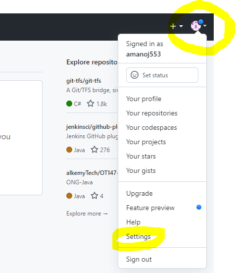 style="width:4.3125in;height:5in" />

2.  Then in left side panel scroll down and select Developer settings

> 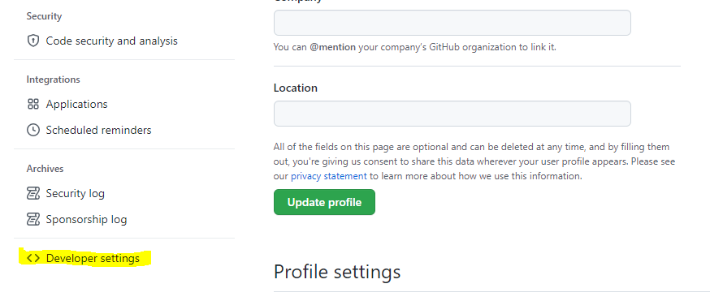 style="width:5in;height:2.125in" />

3.  Then in left side panel click on personal Access tokens

> 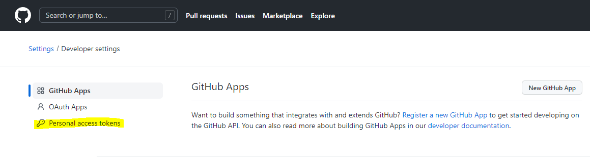 style="width:5in;height:1.39583in" />

4.  In pop up page select generate new token and fill the following
    details

> 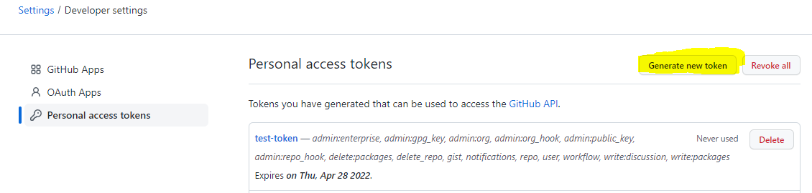 style="width:5in;height:1.19792in" />

5.  Fill in the **Note** filed for which purpose we generate token, add
    **Expiration** date and select **Scopes** which are required for our
    token.

> Then click on Generate token which is available below once you fill in
> all the required details.
>
> 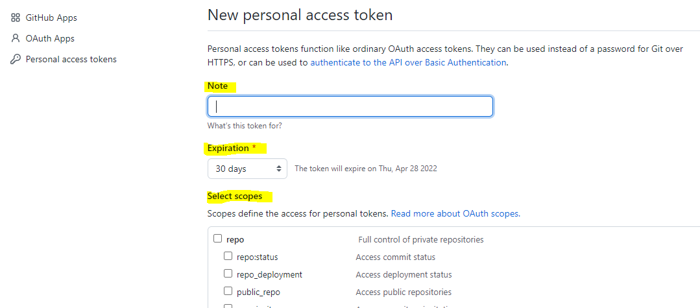 style="width:5in;height:2.19792in" />

6.  Copy the generated token and place it somewhere for further usage
    (token disappears once save the token).

> 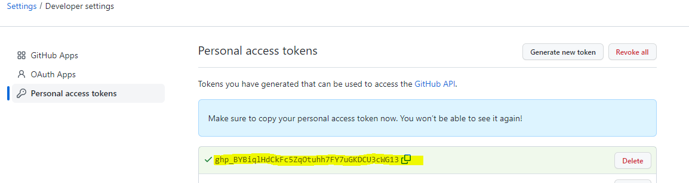 style="width:5in;height:1.33333in" />

7.  If you’ve lost or forgotten this token, you can regenerate it, but
    be aware that any scripts or applications using this token will need
    to be updated.

## From Jenkins' side:

1.  First Login to Jenkins

2.  Add GitHub credentials in Jenkins

In Jenkins Dashboard on left side panel click on ==\> Manage Jenkins

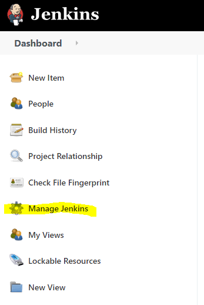

Then scroll down page under Security section ==\> click on manage
credentials

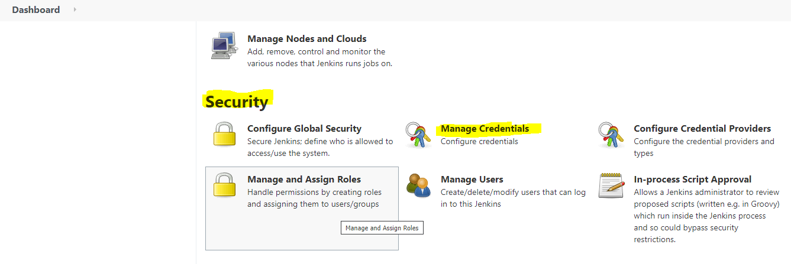

Drop down the menu and select Jenkins shown Under Stores scoped to
Jenkins section below.

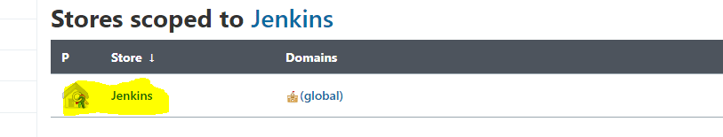

Click on Global credentials (unrestricted)

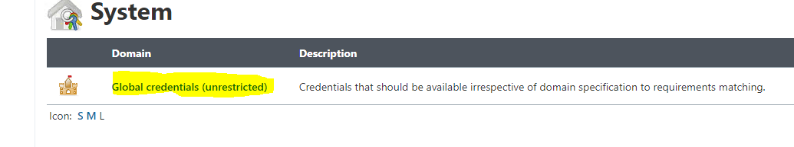

Then on left hand side menu click on Add Credentials

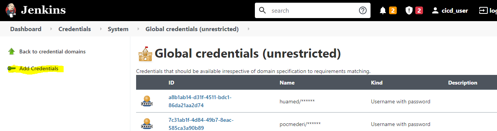

Add below credentials to each section:

**Kind section:** Username with password

**Scope section**: Global (Jenkins, nodes, items, all child items etc.)

**Username:** Add GitHub Username

**Password:** Instead of Add GitHub Password add Personal Access token
which was generated earlier.

**Description section:** add any name for reference.

Then click on the ok button to save GitHub credentials on Jenkins
server.

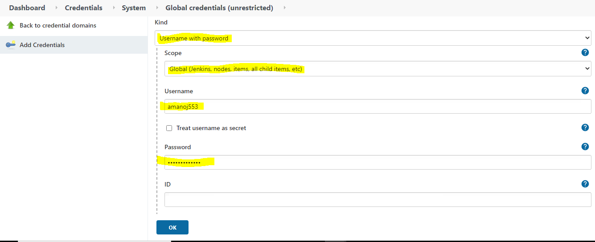

3.  After creating credentials follow below steps for creating Jenkins
    Pipeline job

In Jenkins Dashboard on left side panel click on ==\> New Item.
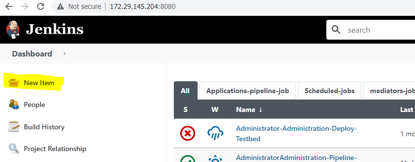

Enter job name with respect to Application \> Choose Pipeline \> Click
OK.

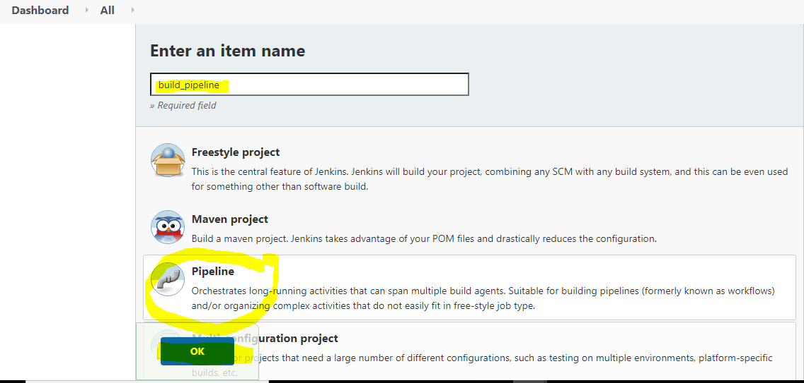

After clicking OK. Goto Build Triggers section ==\> select PollSCM ==\>
In Schedule section give the time period depends on repo commit changes
build periodically.

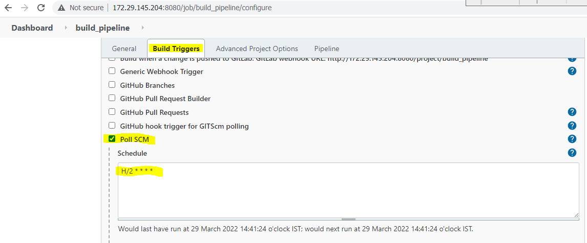

Goto the Pipeline Section and add below pipeline script and click on
apply and save buttons to save Jenkins Pipeline job.

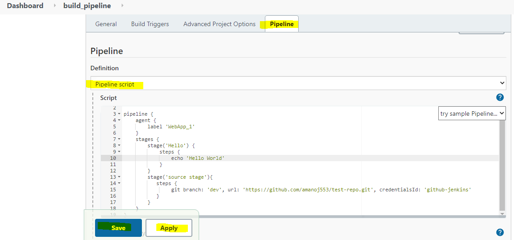

**Note**: if we are cloning Private repo we require GitHub credentials
so, we need to add in Pipeline source stage along with credentials. Not
Required credentials for Public Repo cloning in Pipeline Source stage.

Now the Pipeline Job has been configured successfully and it will run
according to schedule time when the commit changes happen in repository
with Particular branch.

[<- Back to Jenkins Mediator and scheduled Jobs](../Jenkins_Jobs/SDN_Mediator_and_schedule_Jenkins_job.md) - - - [Up to Main](../main.md) - - - [Ahead to Sample Jenkinsfiles ->](../Jenkins_Jobs/Jenkinsfile.md)
