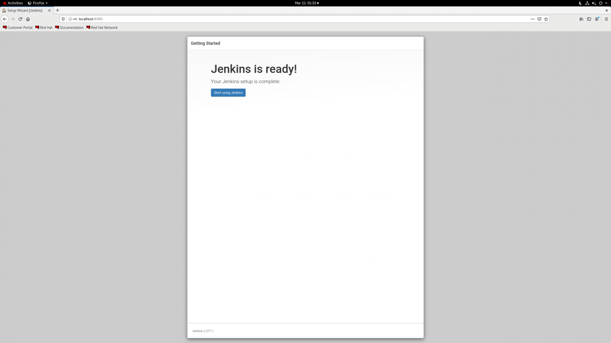

Here we Install following tools in both servers (Jenkins and WebApp) 

## 5.1. Install Git 

$ sudo apt update 

$ sudo apt install git 

$ git - -version 

 Output: 

git version 2.25.1 

## 5.2. Install Java 

$ sudo apt install default-jre 

$ java –version 

 Output: 

openjdk version "11.0.11" 2021-04-20 
OpenJDK Runtime Environment (build 11.0.11+9-Ubuntu-0ubuntu2.18.04) 
OpenJDK 64-Bit Server VM (build 11.0.11+9-Ubuntu-0ubuntu2.18.04, mixed mode, sharing)) 

$ sudo apt install default-jdk 

$ javac –version 

Output: 

javac 11.0.11 

Referral links: 

https://www.digitalocean.com/community/tutorials/how-to-install-java-with-apt-on-ubuntu-18-04 

 

## 5.3. Install Docker 

Here we install docker from Default Repositories: 

$ sudo apt update 

$ sudo apt-get remove docker docker-engine docker.io 

$ sudo apt install docker.io 

$ Docker - -version 

### 5.3.1. To start docker service 

$ sudo systemctl start docker 

$ sudo systemctl enable docker 

$ sudo systemctl status docker 

### 5.3.2. Run docker commands without sudo 

$ sudo groupadd docker 

$ sudo usermod -aG docker [user] 

$ su - [user] // Enable the new settings 

$ id -nG // check to confirm the user is now a part of the docker group 

Referral links: 

https://phoenixnap.com/kb/install-docker-on-ubuntu-20-04 

## 5.4. Install NodeJS and NPM packages 

$ sudo apt get update 

$ sudo apt install nodejs 

$ node –v 

$ sudo apt install npm 

Referral links: 

https://linuxize.com/post/how-to-install-node-js-on-ubuntu-20-04/ 

## 5.5. Install Newman packages and Newman reporter htmlextra package 

$ npm install -g newman 

$ npm install -g newman-reporter-htmlextra 

## 5.6. Install Jenkins

Jenkins-installation-steps: 

For docker package download: 

wget –e use_proxy=yes -e http_proxy=(proxy-ip:8080) https://download.docker.com/linux/static/stable/x86_64/docker-20.10.9.tgz 

For epel-release package download: 

wget –e use_proxy=yes -e http_proxy=(proxy-ip:8080)  https://dl.fedoraproject.org/pub/epel/epel-release-latest-8.noarch.rpm 

For Jenkins repo download: 

sudo wget –e use_proxy=yes -e http_proxy=(proxy-ip:8080) -O /etc/yum.repos.d/jenkins.repo https://pkg.jenkins.io/redhat/jenkins.repo 

For importing key: 

rpm --import https://pkg.jenkins.io/redhat-stable/jenkins.io.key --httpproxy 10.1.17.85  --httpport 8080 

 

For installing Epel-release: 

rpm -ivh epel-release-latest-8.noarch.rpm 

For installing Jenkins: 

yum install jenkins 

Systemctl start jenkins 

Systemctl status jenkins 

Enabled firewall for 8080 port: 

Firewall-cmd - -list-all 

Firewall-cmd - -add-port=8080/tcp - -permanent 

Now, the Jenkins server will be running on port 8080 for our server. 

In browser enter: ip-addr:8080 

Configuring Jenkins: 

You can configure the Jenkins service on port 8080 of your system, but Jenkins is temporarily locked with a password present in the /var/lib/jenkins/secrets/initialAdminPassword file. You can access Jenkins by providing the password after reading the file. 

Image 

Unlock Jenkins 

Cat path-of-initial-password   //for password retrivel 

Then copy password and paste into jenkins page on browser 

Configuring proxy: 

For installing plugins, we need to configure proxy details here (if we are using proxy or else not required): 

Proxy-Ip 

Proxy port number 

 

Install the suggested plugins for Jenkins. They are compatible with most versions, but if you want to do something specific, you can also select and work with the plugins you wish. 

The plugins will take some time to install depending on the connectivity speed, so be patient. 

Create an admin user. Make sure you remember the username and password, as they are the credentials for accessing the Jenkins WebUI. 

 

Specify if you wish to change the port for your Jenkins. It is preferred to use Jenkins on 8080 ports. 

 

 
Jenkins setup is complete and it can be accessed with the URL that is configured for it. 

 

 

Referral links: 

https://www.npmjs.com/package/newman 

https://www.npmjs.com/package/newman-reporter-htmlextra 

[<- Back to list of Installation tools](../Installation/tools_list.md) - - - [Up to Main](../main.md) - - - [Ahead to Jenkins Configurations ->](../Jenkins/Jenkins_Configuration.md)
