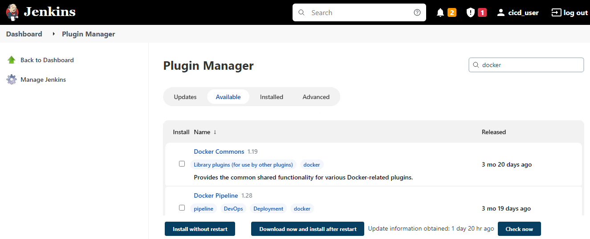
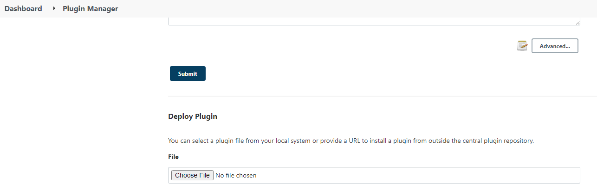
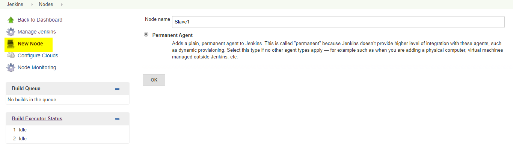

## 6. In Jenkins server 

### 6.1. Jenkins Overview 

#### 6.1.1. What is Jenkins and why do we use it? 

 

Jenkins is an open-source automation tool written in Java with plugins built for Continuous Integration purposes. Jenkins is used to build and test your software projects continuously making it easier for developers to integrate changes to the project, and making it easier for users to obtain a fresh build. It also allows you to continuously deliver your software by integrating with a large number of testing and deployment technologies. 

With Jenkins, organizations can accelerate the software development process through automation. Jenkins integrates development life-cycle processes of all kinds, including build, document, test, package, stage, deploy, static analysis, and much more. 

Jenkins achieves Continuous Integration with the help of plugins. Plugins allow the integration of Various DevOps stages. If you want to integrate a particular tool, you need to install the plugins for that tool. 

#### 6.1.2. Advantages of Jenkins 

It is an open-source tool with great community support. 

It is easy to install. 

## 6.2. Install all required plugins 

In Jenkins by default, we install all required plugins while installing Jenkins. If any plugins are required, we can install manually after configuring Jenkins by the below procedure. 

Required plugins: 

 GitHub integration 

 Docker plugin 

To install plugins first login into Jenkins under Jenkins Dashboard left side we have manage Jenkins options click on that then select manage plugins and under available section search for required plugin and select it then click on install without restart. 

Now same way we can for all required plugins. 

 

 

 

If Any plugins we required to upgrade or downgrade first we download plugins from official plugins site in our local then upload it to Jenkins. 

Referred URL: 

https://updates.jenkins-ci.org/download/plugins/ 

Note: download plugins with .hpi extension. 

To upload plugins to Jenkins Goto, Manage Jenkins==>manage plugins==> under advance section ==>under deploy plugin click on choose file then upload earlier download plugin.   

 

 

 

## 6.3. Configure master-slave configuration for deploying application 

The Jenkins master acts to schedule the jobs, assign slaves, and send builds to slaves to execute the jobs. It will also monitor the slave state (offline or online) and get back the build result responses from slaves and the display build results on the console output. 

Open Jenkins Dashboard  

Click on Manage Jenkins  

Click on Manage Nodes and Clouds 

 

Select New Node from Left and give a name and Make it Permanent Agent then Ok 

Now configure with below details like  

Name: WebApp  

Number of tasks :1  

Remote Root Directory: /home/WebApp 

Labels: WebApp_1 

 

Click on save to create the WebApp Node. 

Now Jenkins server configured with one WebApps node successfully.

It has 1000+ plugins to ease your work. If a plugin does not exist, you can code it and share it with the community. 

It is free of cost. 

It is built with Java and hence, it is portable to all the major platforms.

[<- Back to Installation of tools](../Installation/tools_Install.md) - - - [Up to Main](../main.md) - - - [Ahead to Jenkins Pipeline jobs ->](../Jenkins/Jenkins_Job_Configuration.md)
