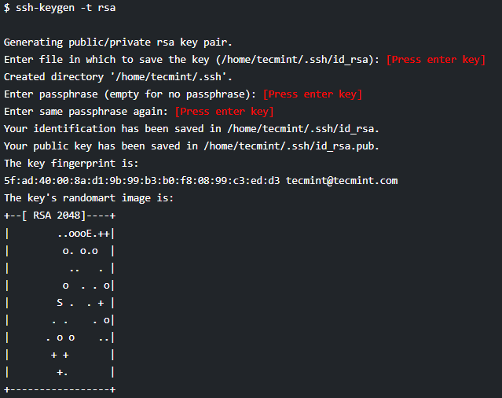

## 3.1. Configure SSH connection between two servers (Jenkins and WebApp servers) 

ssh-keygen –t rsa 

Now share this Key with Slave Machine 

Now use 

ssh-copy-id -i ~/.ssh/id_rsa.pub slave’s ipaddress 

It will ask for root password of slave 

Do the Same steps in Jenkins master and Jenkins slave machines Like:  

In Jenkins master:

ssh-copy-id -i ~/.ssh/id_rsa.pub 172.29.145.71

In Jenkins slave:

ssh-copy-id -i ~/.ssh/id_rsa.pub 172.29.145.204

[<- Back to Prerequisites](../Overview/Prerequisites.md) - - - [Up to Main](../main.md) - - - [Ahead to Challenges ->](../Overview/Challenges.md)
