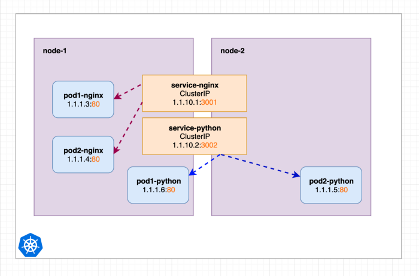
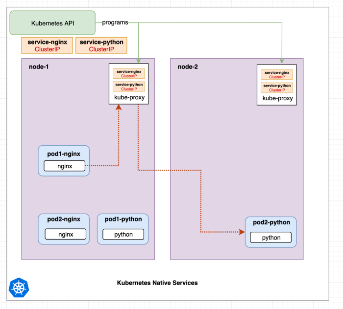
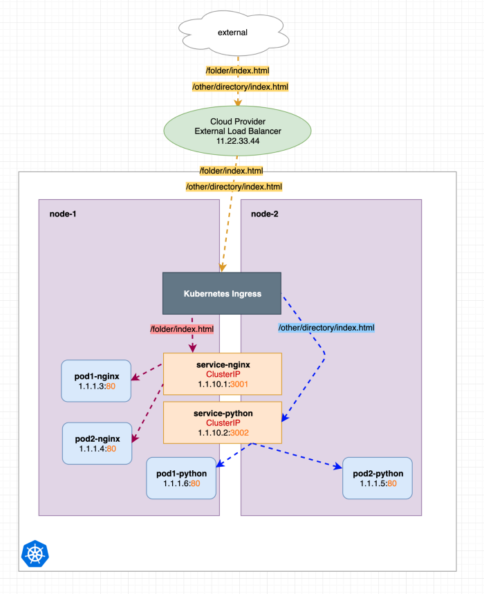
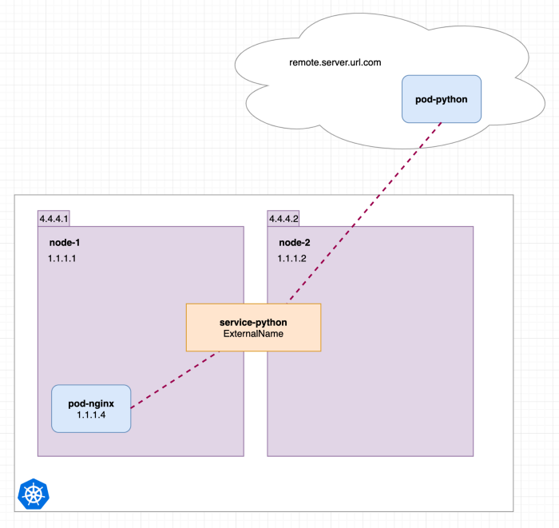
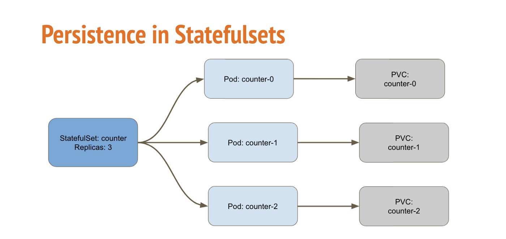
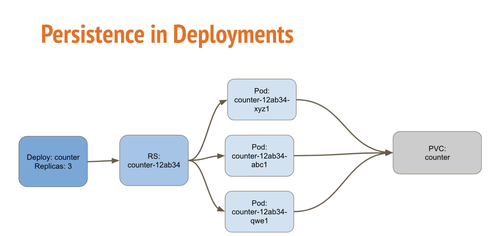

# Document overview and goal

This document provides overview about Kubernetes (K8s) and how it can be utilized for microservice based architecture. The document focus only on concepts of K8s which are used in solution proposal.
It does not contain implementation details like how pod networking is implemented because it depends on K8s plugins and installation.

- [Document overview and goal](#document-overview-and-goal)
- [Kubernetes components](#kubernetes-components)
  - [Control Plane Components](#control-plane-components)
    - [kube-apiserver](#kube-apiserver)
    - [etcd](#etcd)
    - [kube-scheduler](#kube-scheduler)
    - [kube-controller-manager](#kube-controller-manager)
    - [cloud-controller-manager](#cloud-controller-manager)
  - [Node Components](#node-components)
    - [kubelet](#kubelet)
    - [kube-proxy](#kube-proxy)
    - [Container runtime](#container-runtime)
  - [Additional required K8s components (Addons)](#additional-required-k8s-components-addons)
    - [DNS](#dns)
- [Networking](#networking)
  - [East/West communication](#eastwest-communication)
  - [North/South communication](#northsouth-communication)
  - [Communication to external services](#communication-to-external-services)
    - [Direct communication](#direct-communication)
    - [Service type ExternalName](#service-type-externalname)
    - [Headless service](#headless-service)
- [Storage](#storage)
- [Services](#services)
  - [ClusterIP Service](#clusterip-service)
  - [NodePort Service](#nodeport-service)
  - [LoadBalancer Service](#loadbalancer-service)
  - [Ingress](#ingress)
  - [Headless Service](#headless-service-1)
- [Docker image registry](#docker-image-registry)
- [Controller for pods](#controller-for-pods)
  - [StatefulSet](#statefulset)
    - [Persistence](#persistence)
    - [Application update strategy](#application-update-strategy)
      - [Rolling update](#rolling-update)
      - [On Delete](#on-delete)
    - [Limitations](#limitations)
  - [Deployment](#deployment)
    - [Persistence](#persistence-1)
    - [Application update strategy](#application-update-strategy-1)
    - [Limitations](#limitations-1)
- [Health-checks](#health-checks)
  - [Liveness probe](#liveness-probe)
  - [Readiness probe](#readiness-probe)
  - [Stratup probe](#stratup-probe)
- [Solution for applications with existing design](#solution-for-applications-with-existing-design)
  - [Description of current application design](#description-of-current-application-design)
  - [Example](#example)
  - [Benefits for applications](#benefits-for-applications)
  - [Drawbacks for applications](#drawbacks-for-applications)
- [K8s native solution](#k8s-native-solution)
  - [Description of changes](#description-of-changes)
  - [Example](#example-1)
  - [Benefits for applications](#benefits-for-applications-1)
  - [Drawbacks for applications](#drawbacks-for-applications-1)
- [Dependencies on GCP](#dependencies-on-gcp)
  - [Load balancer](#load-balancer)
  - [Persistent disk](#persistent-disk)
- [Others](#others)
- [Useful links](#useful-links)

# Kubernetes components

A Kubernetes cluster consists of a set of worker machines, called nodes, that run containerized applications. Every cluster has at least one worker node.

The worker node(s) host the Pods that are the components of the application workload. The control plane manages the worker nodes and the Pods in the cluster. In production environments, the control plane usually runs across multiple computers and a cluster usually runs multiple nodes, providing fault-tolerance and high availability.

Pods are the smallest deployable units of computing that you can create and manage in Kubernetes.
A Pod is a group of one or more containers, with shared storage and network resources, and a specification for how to run the containers.

## Control Plane Components

### kube-apiserver

The API server is a component of the Kubernetes control plane that exposes the Kubernetes API. The API server is the front end for the Kubernetes control plane.

### etcd

Consistent and highly-available key value store used as Kubernetes' backing store for all cluster data.

### kube-scheduler

Control plane component that watches for newly created Pods with no assigned node, and selects a node for them to run on.

### kube-controller-manager

Control plane component that runs controller processes.

Some types of these controllers are:

- Node controller: Responsible for noticing and responding when nodes go down.
- Job controller: Watches for Job objects that represent one-off tasks, then creates Pods to run those tasks to completion.
- Endpoints controller: Populates the Endpoints object (that is, joins Services & Pods).
- Service Account & Token controllers: Create default accounts and API access tokens for new namespaces.

### cloud-controller-manager

A Kubernetes control plane component that embeds cloud-specific control logic. The cloud controller manager lets you link your cluster into your cloud provider's API, and separates out the components that interact with that cloud platform from components that only interact with your cluster.
The cloud-controller-manager only runs controllers that are specific to your cloud provider. If you are running Kubernetes on your own premises, or in a learning environment inside your own PC, the cluster does not have a cloud controller manager.

## Node Components

### kubelet

An agent that runs on each node in the cluster. It makes sure that containers are running in a Pod.

### kube-proxy

kube-proxy is a network proxy that runs on each node in your cluster, implementing part of the Kubernetes Service concept. kube-proxy maintains network rules on nodes. These network rules allow network communication to your Pods from network sessions inside or outside of your cluster.

### Container runtime

The container runtime is the software that is responsible for running containers.

## Additional required K8s components (Addons)

> brief information about the components(of K8s) which we are using in our design

### DNS

CoreDNS is a flexible, extensible DNS server which can be installed as the in-cluster DNS for pods.
DNS is used for service discovery.

# Networking

The Kubernetes network model specifies:

- Every Pod gets its own IP address. This means you do not need to explicitly create links between Pods and you almost never need to deal with mapping container ports to host ports.
- pods on a node can communicate with all pods on all nodes without NAT
- agents on a node (e.g. system daemons, kubelet) can communicate with all pods on that node
- Kubernetes IP addresses exist at the Pod scope - containers within a Pod share their network namespaces - including their IP address and MAC address. This means that containers within a Pod can all reach each other's ports on localhost.

How this is implemented is a detail of the particular container runtime in use and Container Network Interface (CNI) add-on.

There are 3 networks with different purpose:

- node network: this network provides connectivity among K8s nodes. K8s does not manage this network.
- pod network: this is overlay network which allows all pods to see each other. K8s manages this network.
- service network: it's not a real network where packets would hit a wire but it is an abstraction used for identification of services. It is implemented as iptables rules or IPVS rules managed by kube-proxy.

Kubernetes DNS schedules a DNS Pod and Service on the cluster, and configures the kubelets to tell individual containers to use the DNS Service's IP to resolve DNS names.

Every Service and Pod defined in the cluster (including the DNS server itself) is assigned a DNS name. By default, a client Pod's DNS search list includes the Pod's own namespace and the cluster's default domain.

## East/West communication

> how connection between containers will be established(K8s networking internal communication)

Pods are ephemeral so their identity/IP can change. Service (type ClusterIP) provides an abstraction and loadbalancing to application which is replicated in multiple pods. It allows communiction between pods without having direct dependency on pod instance.

Image below shows a Kubernetes cluster with two nodes and 4 pods with one container each. There is service service-nginx which points to the nginx pods and service service-python which points to the python pods. 

In next image, the red line shows a request made from the nginx container in pod1-nginx to the service-python service, which redirects the request to pod2-python.

ClusterIP services do a simple random or round-robin distribution by default. Services in Kubernetes are not living on specific nodes but simply exist in the whole cluster.

## North/South communication

> how connection from outside to containers will be established(K8s networking external communication)

It is assumed that only http/https traffic will be send to services in K8s cluster. In order to safe IP addresses, we can use just one IP for a load balancer which represents all services living in K8s cluster. Load balancer will send all traffic to Ingress. Ingress can forward traffic based on rules to particular services. There are multiple implementations (Addons) of Ingress controller - nginx is the most common one and it can route traffic based on Host header and URL. Ingress can also do TLS termination and many more.

We can see that we only hit one LoadBalancer (11.22.33.44) but with different http urls, the requests are displayed in yellow as its the same target and just contains different content (request urls).

## Communication to external services

> how connection from containers to outside will be established(K8s networking external communication)

### Direct communication

If a pod does not know how to reach an external IP, then the routing will happen based on node's routing table.

### Service type ExternalName

Service (type: ExternalName) points to DNS record of external service. This is helpful for situation when external service is planned to be migrated to K8s.

### Headless service

It is possible to define headless Service (clusterIP: None) which uses Endpoint with hardcoded IP of external service.

# Storage

On-disk files in a container are ephemeral, which presents some problems for non-trivial applications when running in containers. One problem is the loss of files when a container crashes. The kubelet restarts the container but with a clean state.

Managing storage is a distinct problem from managing compute instances. The PersistentVolume subsystem provides an API for users and administrators that abstracts details of how storage is provided from how it is consumed. To do this, we introduce two new API resources: PersistentVolume and PersistentVolumeClaim.

A PersistentVolume (PV) is a piece of storage in the cluster that has been provisioned by an administrator or dynamically provisioned using Storage Classes. It is a resource in the cluster just like a node is a cluster resource. PVs are volume plugins like Volumes, but have a lifecycle independent of any individual Pod that uses the PV. This API object captures the details of the implementation of the storage, be that NFS, iSCSI, or a cloud-provider-specific storage system.

A PersistentVolumeClaim (PVC) is a request for storage by a user. It is similar to a Pod. Pods consume node resources and PVCs consume PV resources. Pods can request specific levels of resources (CPU and Memory). Claims can request specific size and access modes (e.g., they can be mounted ReadWriteOnce, ReadOnlyMany or ReadWriteMany, see AccessModes).

While PersistentVolumeClaims allow a user to consume abstract storage resources, it is common that users need PersistentVolumes with varying properties, such as performance, for different problems. Cluster administrators need to be able to offer a variety of PersistentVolumes that differ in more ways than size and access modes, without exposing users to the details of how those volumes are implemented. For these needs, there is the StorageClass resource.

There are two ways PVs may be provisioned: statically (created by cluster administrator) or dynamically (created by StorageClass). Each StorageClass has a provisioner that determines what volume plugin is used for provisioning PVs.

# Services

An abstract way to expose an application running on a set of Pods as a network service.
With Kubernetes you don't need to modify your application to use an unfamiliar service discovery mechanism. Kubernetes gives Pods their own IP addresses and a single DNS name for a set of Pods, and can load-balance across them.

## ClusterIP Service

Exposes the Service on a cluster-internal IP (can be set manually). Choosing this value makes the Service only reachable from within the cluster. This is the default ServiceType.

## NodePort Service

Exposes the Service on each Node's IP at a static port (the NodePort). A ClusterIP Service, to which the NodePort Service routes, is automatically created. You'll be able to contact the NodePort Service, from outside the cluster, by requesting NodeIP:NodePort.

Using a NodePort gives you the freedom to set up your own load balancing solution, to configure environments that are not fully supported by Kubernetes, or even to expose one or more nodes' IPs directly.

## LoadBalancer Service

Exposes the Service externally using a cloud provider's load balancer. NodePort and ClusterIP Services, to which the external load balancer routes, are automatically created.

## Ingress

Ingress manages external access to the services in a cluster, typically HTTP. Ingress may provide load balancing, SSL termination and name-based virtual hosting. It is not necessary to have LB per service because LB will just forward traffic to Ingress and Ingress will select a service based on rules. That means Ingress itself is exposed as a service type LoadBalancer.

## Headless Service

For headless Services, a cluster IP is not allocated, kube-proxy does not handle these Services, and there is no load balancing or proxying done by the platform for them. DNS resolver for headless service returns list of A records for each pod behind the service.

# Docker image registry
K8s can use various docker registries. Gitlab is a good candidate to keep images with potential cleanup policy.

# Controller for pods
> deployment strategies (create, upgrade, or downgrade different versions of application)

> how containers will be deployed ( Pod creation , internal IP allocation , persistent volume mapping)

## StatefulSet

StatefulSet is the workload API object used to manage stateful applications.
StatefulSets are valuable for applications that require one or more of the following:

- Stable, unique network identifiers.
- Stable, persistent storage.
- Ordered, graceful deployment and scaling.
- Ordered, automated rolling updates.

### Persistence

StatefulSets is used for stateful applications, each replica of the pod will have its own state, and will be using its own volume. The backing storage can have ReadWriteOnce accessMode.

### Application update strategy

#### Rolling update

Kubernetes uses Rolling update as default updating strategy.

StatefulSet controller will delete and recreate each Pod in the StatefulSet. It will proceed in the same order as Pod termination (from the largest ordinal to the smallest), updating each Pod one at a time.

The Kubernetes control plane waits until an updated Pod is Running and Ready prior to updating its predecessor.

#### On Delete

StatefulSet controller will not automatically update the Pods in a StatefulSet. Users must manually delete Pods to cause the controller to create new Pods that reflect modifications made to a StatefulSet's template.

### Limitations

- The storage for a given Pod must either be provisioned by a PersistentVolume Provisioner based on the requested storage class, or pre-provisioned by an admin.
- StatefulSets currently require a Headless Service to be responsible for the network identity of the Pods. You are responsible for creating this Service.
- StatefulSets do not provide any guarantees on the termination of pods when a StatefulSet is deleted. To achieve ordered and graceful termination of the pods in the StatefulSet, it is possible to scale the StatefulSet down to 0 prior to deletion.
- When using Rolling Updates with the default Pod Management Policy (OrderedReady), it's possible to get into a broken state that requires manual intervention to repair. <https://kubernetes.io/docs/concepts/workloads/controllers/statefulset/#forced-rollback>

## Deployment

### Persistence

Deployment is a resource to deploy a stateless application, if using a PVC, all replicas will be using the same volume (shared volume) and none of it will have its own state. The backing storage must have ReadWriteMany or ReadOnlyMany accessMode if you have more than one replica pod.

### Application update strategy

Kubernetes uses Rolling update as default updating strategy.

There is great example how:

- deployment is created <https://kubernetes.io/docs/concepts/workloads/controllers/deployment/#creating-a-deployment>
- deployment is udpated <https://kubernetes.io/docs/concepts/workloads/controllers/deployment/#updating-a-deployment>
- deployment is rolled back <https://kubernetes.io/docs/concepts/workloads/controllers/deployment/#rolling-back-a-deployment>

### Limitations

Even Deployments with one replica using ReadWriteOnce volume are not recommended. This is because the default Deployment strategy creates a second Pod before bringing down the first Pod on a recreate. The Deployment may fail in deadlock as the second Pod can't start because the ReadWriteOnce volume is already in use, and the first Pod won't be removed because the second Pod has not yet started. Instead, use a StatefulSet with ReadWriteOnce volumes.

# Health-checks

> other aspects of Kubernetes which we can utilize in our application for a healthier production environment

Liveness, readiness and startup probes can be set for containers. Kubernetes does not specify how these probes should be implemented so it is up to an application. Probes can be configured to send HTTP GET request, open TCP connection on specified port, execute a command in container or use gRPC health-check.

## Liveness probe

The kubelet uses liveness probes to know when to restart a container. For example, liveness probes could catch a deadlock, where an application is running, but unable to make progress. Restarting a container in such a state can help to make the application more available despite bugs.

## Readiness probe

The kubelet uses readiness probes to know when a container is ready to start accepting traffic. A Pod is considered ready when all of its containers are ready. One use of this signal is to control which Pods are used as backends for Services. When a Pod is not ready, it is removed from Service load balancers.

## Stratup probe

The kubelet uses startup probes to know when a container application has started. If such a probe is configured, it disables liveness and readiness checks until it succeeds, making sure those probes don't interfere with the application startup. This can be used to adopt liveness checks on slow starting containers, avoiding them getting killed by the kubelet before they are up and running.

# Solution for applications with existing design

## Description of current application design

An application uses load file (file with JSON format) to store information about services it provides, services which it can reach and forwarding information. Current application design assumes that the load file is changed during runtime via application's REST API. The application can also store internal data to other files.

This kind of application design means that applications are stateful and StatefulSet needs to be used to deploy and control pods. Hovewer, current applications are not aware of their replicas so they cannot share data with replicas. That means we can have only one instance of an application without horizontal scaling or HA.

Despite the fact that an application cannot scale and do not provide HA, it is possible to monitor the application via health-check and reschedule it if there is any problem. Update of the application can be done via Rolling update.

## Example

In this example we have two applications APP-FOO and APP-BAR. Application APP-FOO stores data to file and calls APP-BAR. APP-BAR also stores data to file at runtime. APP-FOO is accessible from outside of the K8s cluster via Ingress.

## Benefits for applications

- auto-healing and pod rescheduling
- DNS based service discovery
- horizontal scaling of nodes
- rolling update

## Drawbacks for applications

- sharing of one file to multiple app replicas is not possible
- no horizontal scaling for apps
- no load balancing to multiple repolicas via service

# K8s native solution

## Description of changes

- separation of static data (data never change during runtime) from dynamic (data are changed at runtime)
- static data will be stored in ConfigMap and injected to application (pod). Example of static data is baseUrl how to reach other services, database connection string, etc.
- dynamic data will be stored in Database so they can be used by multiple replicas
- Database instances are shared among applications and can be reached from any pod
- each application uses and maintains separate logical database which is shared among application replicas

This design focus on stateless applications which are deployed and controled via Deployment. That allows to scale applications horizontaly and provides HA setup.

## Example

## Benefits for applications

- auto-healing and pod rescheduling
- DNS based service discovery
- horizontal scaling of pods
- load balancing to multiple replicas via service
- horizontal scaling of nodes
- rolling update

## Drawbacks for applications

- sharing of one file to multiple app instances will not work due to GCP Persistent Disk access modes. But even if that is possible, probably there would be additional problems like "multiple writers problem" requiring lock file mechanism.

# Dependencies on GCP

> how persistent volumes will be created and utilized by the applications

## Load balancer

In case a service type loadbalancer is used we create a dependency on GCP load balancer. This can be avoided by provisioning and configuring some LB manually.

## Persistent disk

GCP Persistence Disk supports only ReadWriteOnce and ReadOnlyMany access mode. That means Deployment can be used only with 1 replica and ReadWriteOnce PV.

# Others

> how transaction between containers are captured (transaction management)

K8s does not care about transaction management. Transaction management is responsibility of microservice architecture design.

> any risks that needs to be known

Kubernetes becomes a standard for deploying applications with microservice architecture. It solves many problems for the architecture but it also brings additional complexity which requires knowledge.

There are additional solutions which simplify microservice architecture like service meshes (Istio, Linkerd, Consul..) and they can be used together with Kubernetes. Service mesh can help with distrubuted tracing of HTTP communication, TLS encryption between services, policy enforcement between services, etc.

# Useful links

<https://kubernetes.io/docs/home/>

<https://medium.com/@wuestkamp/kubernetes-ingress-simply-visually-explained-d9cad44e4419>

<https://medium.com/avmconsulting-blog/how-to-perform-health-checks-in-kubernetes-k8s-a4e5300b1f9d>